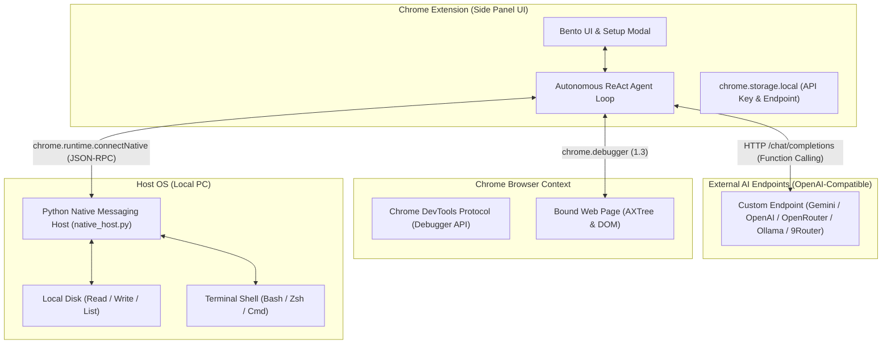

# 📑 DOKUMENTASI TEKNIS - BROWSER AGENT (STANDALONE)

Dokumen ini adalah referensi arsitektur teknis, protokol komunikasi, dan sistem tool-calling otonom untuk **Browser Agent**.

---

## 🏗️ 1. Arsitektur Sistem

---

## 🛠️ 2. Spesifikasi Tool Calling (16 Tools)

### A. Browser Automation & Multi-Tab Tools (12 Tools via CDP & Tabs API)
1. `browser_navigate(url)`: Mengarahkan tab aktif ke URL yang ditentukan.
2. `browser_snapshot()`: Mengambil snapshot DOM interaktif dan Accessibility Tree dengan `backendNodeId`.
3. `browser_click(backendNodeId)`: Menghitung koordinat box model dan menyimulasikan klik mouse via CDP.
4. `browser_type(backendNodeId, text, pressEnter)`: Memfokuskan input dan menyisipkan teks.
5. `browser_press_key(key)`: Mengirimkan sinyal keyboard event (`Enter`, `Escape`, `Tab`, dll).
6. `browser_hover(backendNodeId)`: Mengarahkan pointer kursor ke atas elemen.
7. `browser_scroll(scrollX, scrollY)`: Menggulir halaman web dengan delta piksel.
8. `browser_screenshot()`: Mengambil tangkapan layar tab aktif dalam format base64 PNG.
9. `browser_get_console_logs()`: Mengambil log konsol dan runtime error tab.
10. `browser_list_tabs()`: Menampilkan seluruh tab browser yang sedang terbuka (tabId, title, url, active).
11. `browser_switch_tab(tabId)`: Berpindah fokus dan mengikat kontrol agent ke tab tertentu berdasarkan tabId, judul/URL fuzzy, atau auto-open service URL.
12. `browser_create_tab(url)`: Membuka tab baru di browser dan langsung mengalihkan fokus agent ke tab tersebut.

### B. Local PC Tools (4 Tools via Native Host JSON-RPC)
13. `local_read_file(path)`: Membaca teks file dari disk lokal PC pengguna.
14. `local_write_file(path, content)`: Menulis atau membuat file baru di PC lokal (auto-create parent directories).
15. `local_list_dir(path)`: Menampilkan daftar file dan folder beserta ukuran dan tipe file.
16. `local_run_command(command, cwd)`: Menjalankan perintah terminal di PC lokal dengan capture stdout, stderr, dan exit code.

---

## ⚙️ 3. Konfigurasi AI & Presets

- **Penyimpanan:** Disimpan secara aman di `chrome.storage.local`.
- **Dukungan Format:** Mengikuti standar OpenAI Chat Completions API (`/chat/completions`) dengan `tools` parameter.
- **Provider Presets:**
  - **Google Gemini:** `https://generativelanguage.googleapis.com/v1beta/openai` (Model: `gemini-2.5-flash`, `gemini-2.5-pro`).
  - **OpenAI:** `https://api.openai.com/v1` (Model: `gpt-4o`, `gpt-4o-mini`).
  - **OpenRouter:** `https://openrouter.ai/api/v1` (Multi-provider model selection).
  - **Ollama Local:** `http://localhost:11434/v1` (Local open-source models).
  - **9Router Local:** `http://localhost:20128/v1` (Local router / proxy).
  - **Custom Endpoint:** URL kustom pengguna + input nama model bebas.

---

## 🔒 4. Keamanan & Target Tab Pinning

1. **Target Tab Binding:** Saat sidepanel dimuat, target debugger langsung dikunci ke tab awal. Berpindah ke tab lain saat multitasking tidak akan memindahkan target automasi.
2. **Re-binding Interaktif:** Pengguna dapat berpindah target tab kapan saja dengan mengklik chip status `Tab: [Nama]`.
3. **Local RPC Isolation:** Hanya ekstensi dengan ID yang terdaftar dalam manifest Native Messaging yang diizinkan memanggil RPC file dan shell execution.

---

## 🧠 5. Hermes-Surpassing Persistent Memory & Dual-Process Cognitive Engine

Browser Agent dilengkapi arsitektur kognitif tingkat lanjut (Dual-Process Engine: System 1 Reactive Controller + System 2 Meta-Executive MCTS Engine) dengan mekanisme **Dual-Sync** (SQLite Database + Git-Tracked Markdown Files di folder `PERSISTENT MEMORY/`):

1. **User Profile & Working Rules (`user_memories` / `personal_facts.md`):**
   - Menyimpan fakta personal, preferensi user, dan aturan kerja permanen yang diekstrak AI atau diinput user.
2. **Dynamic Epistemic Knowledge Hypergraph (`graph_epistemic_triplets` / `knowledge_graph/triplets.md`):**
   - Menyimpan relasi entitas $(Subject \to Predicate \to Object)$ dengan mathematical decay $c(t) = c_0 \cdot \exp(-\ln(2)/\tau \cdot \Delta t)$, conflict resolution dinamis, dan negative constraints (jalur terlarang).
3. **Experience Ledger (`experience_ledger` / `02_EXPERIENCE_LEDGER/`):**
   - Distilasi intisari pengalaman tiap sesi percakapan ke dalam format Markdown poin-poin terstruktur.
4. **Anti-Patterns & Failure Learnings (`anti_patterns` / `failure_learnings.md`):**
   - Mencatat deskripsi kesalahan, root cause, winning fix, dan aturan pencegahan agar AI tidak pernah mengulangi kesalahan masa lalu.
5. **Autonomous Skills & Agents Vault (`autonomous_skills` & `autonomous_agents`):**
   - AI mampu secara mandiri menciptakan skill baru (`create_autonomous_skill`), mengedit skill miliknya sendiri (`update_autonomous_skill`), melahirkan sub-agent spesialis (`create_autonomous_agent`), serta mengeksekusi script sandbox instan (`execute_jit_microtool`).
6. **Pre-Edit Rollback History Engine (`persistent_item_history` / `.history/`):**
   - Setiap modifikasi pada skill, agent persona, atau memori otomatis membuat snapshot rollback sebelum data diubah.
7. **Dynamic Prompt Retrieval Engine:**
   - Menyuntikkan fakta personal, checklist anti-pattern, epistemic triplets, dan daftar autonomous skills langsung ke dalam `buildDynamicSystemPrompt` dengan standar Anti-AI-Slop tingkat tinggi.

---

## 🛡️ 6. Protokol Versioning & Restore Points

- **Versi Terkini:** `v2.150.108`
- **Catatan Detail Restore Point:** [RESTORE_POINTS.md](file:///home/arya/browser-agent/RESTORE_POINTS.md)
- **Alat Bantu Otomatis:**
  - `./create_restore_point.sh <VERSION_TAG> "<DESKRIPSI>"`: Membuat restore point baru, commit git, backup ZIP percakapan Antigravity, dan push ke repository GitHub.
  - `./restore.sh list`: Menampilkan seluruh daftar versi dan restore point yang tersedia.
  - `./restore.sh <VERSION_TAG>`: Rollback instan 1-klik ke versi stabil pilihan.
- **Mandat Agent:** Selalu menyebutkan versi terbaru yang aktif di setiap balasan akhir.

---

## 🎨 7. Zero-Emoji Architecture & Vector SVG Asset Standard

1. **Aturan Mutlak:** Seluruh antarmuka Pengaturan (`options.html`), Panel Samping (`sidepanel.html`), kartu Persistent Memory (`options.js`), modal dialog plugin (Ponytail, KV Cache, Caveman, Claude Fable), modul Connected Apps (Telegram, Google Workspace), dan generator Markdown **100% bebas dari emoji / emoticon Unicode**.
2. **Dedicated SVG Library (`extension/icons/svg/`):** Semua simbol visual menggunakan Vector SVG murni dengan rendering tajam, responsif, dan konsisten dengan tema Dark Luxury Glassmorphism.
3. **Unified Bento Hero Headers:** Seluruh view (LLM Providers, Multi-Agent Management, Skills Catalog, Memories Management, Persistent Brain, Tampilan & UI, Connected Apps, Plugin Ecosystem) menggunakan container glass rounded yang 100% seragam (`.bento-hero-provider-card`).
4. **Resilient Multi-Engine Web Search (`google_web_search`):** Menggabungkan Google News Realtime RSS, Wikipedia Knowledge Engine, dan Bing RSS Search untuk menjamin keberhasilan pencarian web 100% tanpa risiko terblokir ISP/DNS (TrustPositif / SSL Mismatch).
5. **Unified Search & View Mode Switcher Capsule:** Tombol toggle view (`Grid Cards` & `Neural Graph`) diintegrasikan langsung ke dalam satu kapsul container input pencarian (`.brain-search-unified-box`) agar tampilan lebih bersih, minimalis, dan elegan.
6. **Sleek Single Dropdown Filter for Neural Graph:** Mengganti deretan tombol filter horizontal yang memakan tempat menjadi satu tombol dropdown compact (`.graph-filter-dropdown-btn`) dengan popover glassmorphism (`.graph-filter-dropdown-menu`).
7. **Clean Non-Nested View Buttons:** Menghilangkan container border luar pada switcher view mode sehingga tombol `Grid Cards` & `Neural Graph` menyatu langsung setinggi kapsul pencarian tanpa lapisan border ganda.
8. **Ultra-Clarity High-Contrast Frosted Glass:** Dropdown filter menggunakan backdrop blur `40px saturate(220%)` dengan background `rgba(10, 10, 14, 0.96)`, inner border highlight, dan text-shadow tajam agar teks selalu terbaca jernih di atas animasi node canvas.
9. **Vector SVG Filter Icons (No Bullets/Emoticons):** Setiap opsi filter cluster pada dropdown dilengkapi ikon Vector SVG presisi tinggi (Brain, Multi-Agent, Tools, Rules, Ledger, Anti-Patterns, Corpus, Graph, Chip) untuk tampilan profesional tanpa bullet dot atau emoticon.

