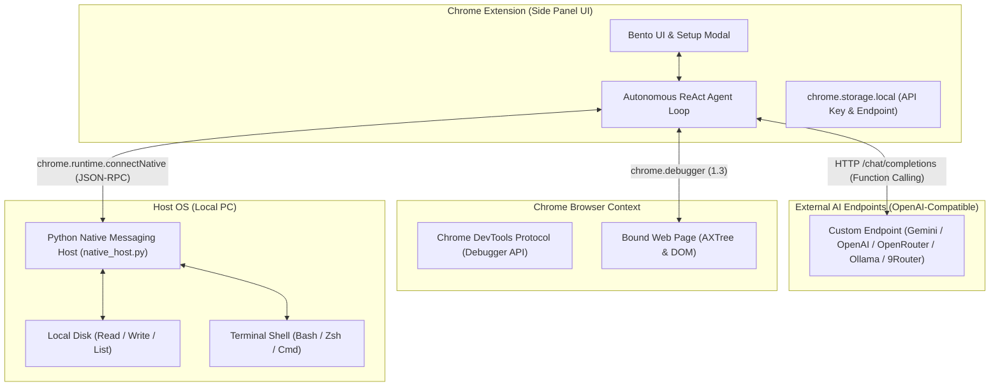

# 📑 DOKUMENTASI TEKNIS - BROWSER AGENT (STANDALONE)

Dokumen ini adalah referensi arsitektur teknis, protokol komunikasi, dan sistem tool-calling otonom untuk **Browser Agent**.

---

## 🏗️ 1. Arsitektur Sistem

---

## 🛠️ 2. Spesifikasi Tool Calling (16 Tools)

### A. Browser Automation & Multi-Tab Tools (12 Tools via CDP & Tabs API)
1. `browser_navigate(url)`: Mengarahkan tab aktif ke URL yang ditentukan.
2. `browser_snapshot()`: Mengambil snapshot DOM interaktif dan Accessibility Tree dengan `backendNodeId`.
3. `browser_click(backendNodeId)`: Menghitung koordinat box model dan menyimulasikan klik mouse via CDP.
4. `browser_type(backendNodeId, text, pressEnter)`: Memfokuskan input dan menyisipkan teks.
5. `browser_press_key(key)`: Mengirimkan sinyal keyboard event (`Enter`, `Escape`, `Tab`, dll).
6. `browser_hover(backendNodeId)`: Mengarahkan pointer kursor ke atas elemen.
7. `browser_scroll(scrollX, scrollY)`: Menggulir halaman web dengan delta piksel.
8. `browser_screenshot()`: Mengambil tangkapan layar tab aktif dalam format base64 PNG.
9. `browser_get_console_logs()`: Mengambil log konsol dan runtime error tab.
10. `browser_list_tabs()`: Menampilkan seluruh tab browser yang sedang terbuka (tabId, title, url, active).
11. `browser_switch_tab(tabId)`: Berpindah fokus dan mengikat kontrol agent ke tab tertentu berdasarkan tabId, judul/URL fuzzy, atau auto-open service URL.
12. `browser_create_tab(url)`: Membuka tab baru di browser dan langsung mengalihkan fokus agent ke tab tersebut.

### B. Local PC Tools (4 Tools via Native Host JSON-RPC)
13. `local_read_file(path)`: Membaca teks file dari disk lokal PC pengguna.
14. `local_write_file(path, content)`: Menulis atau membuat file baru di PC lokal (auto-create parent directories).
15. `local_list_dir(path)`: Menampilkan daftar file dan folder beserta ukuran dan tipe file.
16. `local_run_command(command, cwd)`: Menjalankan perintah terminal di PC lokal dengan capture stdout, stderr, dan exit code.

---

## ⚙️ 3. Konfigurasi AI & Presets

- **Penyimpanan:** Disimpan secara aman di `chrome.storage.local`.
- **Dukungan Format:** Mengikuti standar OpenAI Chat Completions API (`/chat/completions`) dengan `tools` parameter.
- **Provider Presets:**
  - **Google Gemini:** `https://generativelanguage.googleapis.com/v1beta/openai` (Model: `gemini-2.5-flash`, `gemini-2.5-pro`).
  - **OpenAI:** `https://api.openai.com/v1` (Model: `gpt-4o`, `gpt-4o-mini`).
  - **OpenRouter:** `https://openrouter.ai/api/v1` (Multi-provider model selection).
  - **Ollama Local:** `http://localhost:11434/v1` (Local open-source models).
  - **9Router Local:** `http://localhost:20128/v1` (Local router / proxy).
  - **Custom Endpoint:** URL kustom pengguna + input nama model bebas.

---

## 🔒 4. Keamanan & Target Tab Pinning

1. **Target Tab Binding:** Saat sidepanel dimuat, target debugger langsung dikunci ke tab awal. Berpindah ke tab lain saat multitasking tidak akan memindahkan target automasi.
2. **Re-binding Interaktif:** Pengguna dapat berpindah target tab kapan saja dengan mengklik chip status `Tab: [Nama]`.
3. **Local RPC Isolation:** Hanya ekstensi dengan ID yang terdaftar dalam manifest Native Messaging yang diizinkan memanggil RPC file dan shell execution.

---

## 🧠 5. Hermes-Surpassing Persistent Memory & Dual-Process Cognitive Engine

Browser Agent dilengkapi arsitektur kognitif tingkat lanjut (Dual-Process Engine: System 1 Reactive Controller + System 2 Meta-Executive MCTS Engine) dengan mekanisme **Dual-Sync** (SQLite Database + Git-Tracked Markdown Files di folder `PERSISTENT MEMORY/`):

1. **User Profile & Working Rules (`user_memories` / `personal_facts.md`):**
   - Menyimpan fakta personal, preferensi user, dan aturan kerja permanen yang diekstrak AI atau diinput user.
2. **Dynamic Epistemic Knowledge Hypergraph (`graph_epistemic_triplets` / `knowledge_graph/triplets.md`):**
   - Menyimpan relasi entitas $(Subject \to Predicate \to Object)$ dengan mathematical decay $c(t) = c_0 \cdot \exp(-\ln(2)/\tau \cdot \Delta t)$, conflict resolution dinamis, dan negative constraints (jalur terlarang).
3. **Experience Ledger (`experience_ledger` / `02_EXPERIENCE_LEDGER/`):**
   - Distilasi intisari pengalaman tiap sesi percakapan ke dalam format Markdown poin-poin terstruktur.
4. **Anti-Patterns & Failure Learnings (`anti_patterns` / `failure_learnings.md`):**
   - Mencatat deskripsi kesalahan, root cause, winning fix, dan aturan pencegahan agar AI tidak pernah mengulangi kesalahan masa lalu.
5. **Autonomous Skills & Agents Vault (`autonomous_skills` & `autonomous_agents`):**
   - AI mampu secara mandiri menciptakan skill baru (`create_autonomous_skill`), mengedit skill miliknya sendiri (`update_autonomous_skill`), melahirkan sub-agent spesialis (`create_autonomous_agent`), serta mengeksekusi script sandbox instan (`execute_jit_microtool`).
6. **Pre-Edit Rollback History Engine (`persistent_item_history` / `.history/`):**
   - Setiap modifikasi pada skill, agent persona, atau memori otomatis membuat snapshot rollback sebelum data diubah.
7. **Dynamic Prompt Retrieval Engine:**
   - Menyuntikkan fakta personal, checklist anti-pattern, epistemic triplets, dan daftar autonomous skills langsung ke dalam `buildDynamicSystemPrompt` dengan standar Anti-AI-Slop tingkat tinggi.

---

###### 🛡️ 6. Protokol Versioning & Restore Points

- **Versi Terkini:** `v2.150.191`
- **Catatan Detail Restore Point:** [RESTORE_POINTS.md](file:///home/arya/browser-agent/RESTORE_POINTS.md)
- **Alat Bantu Otomatis:**
  - `./create_restore_point.sh <VERSION_TAG> "<DESKRIPSI>"`: Membuat restore point baru, commit git, backup ZIP percakapan Antigravity, dan push ke repository GitHub.
  - `./restore.sh list`: Menampilkan seluruh daftar versi dan restore point yang tersedia.
  - `./restore.sh <VERSION_TAG>`: Rollback instan 1-klik ke versi stabil pilihan.
  - **Mandat Agent:** Selalu menyebutkan versi terbaru yang aktif di setiap balasan akhir.

---

## 🎨 7. Zero-Emoji Architecture & Vector SVG Asset Standard

1. **Aturan Mutlak:** Seluruh antarmuka Pengaturan (`options.html`), Panel Samping (`sidepanel.html`), kartu Persistent Memory (`options.js`), modal dialog plugin (Ponytail, KV Cache, Caveman, Claude Fable), modul Connected Apps (Telegram, Google Workspace), dan generator Markdown **100% bebas dari emoji / emoticon Unicode**.
2. **Dedicated SVG Library (`extension/icons/svg/`):** Semua simbol visual menggunakan Vector SVG murni dengan rendering tajam, responsif, dan konsisten dengan tema Dark Luxury Glassmorphism.
3. **Unified Bento Hero Headers:** Seluruh view (LLM Providers, Multi-Agent Management, Skills Catalog, Memories Management, Persistent Brain, Tampilan & UI, Connected Apps, Plugin Ecosystem) menggunakan container glass rounded yang 100% seragam (`.bento-hero-provider-card`).
4. **Resilient Multi-Engine Web Search (`google_web_search`):** Menggabungkan Google News Realtime RSS, Wikipedia Knowledge Engine, dan Bing RSS Search untuk menjamin keberhasilan pencarian web 100% tanpa risiko terblokir ISP/DNS (TrustPositif / SSL Mismatch).
5. **Unified Search & View Mode Switcher Capsule:** Tombol toggle view (`Grid Cards` & `Neural Graph`) diintegrasikan langsung ke dalam satu kapsul container input pencarian (`.brain-search-unified-box`) agar tampilan lebih bersih, minimalis, dan elegan.
6. **Sleek Single Dropdown Filter for Neural Graph:** Mengganti deretan tombol filter horizontal yang memakan tempat menjadi satu tombol dropdown compact (`.graph-filter-dropdown-btn`) dengan popover glassmorphism (`.graph-filter-dropdown-menu`).
7. **Clean Non-Nested View Buttons:** Menghilangkan container border luar pada switcher view mode sehingga tombol `Grid Cards` & `Neural Graph` menyatu langsung setinggi kapsul pencarian tanpa lapisan border ganda.
8. **Ultra-Clarity High-Contrast Frosted Glass:** Dropdown filter menggunakan backdrop blur `40px saturate(220%)` dengan background `rgba(10, 10, 14, 0.96)`, inner border highlight, dan text-shadow tajam agar teks selalu terbaca jernih di atas animasi node canvas.
9. **Universal Search Glasses & Normalized 48px Layout Across All Menus:** Standar kapsul pencarian bulat penuh (`border-radius: 9999px`, tinggi `48px`, padding simetris, jarak vertikal atas-bawah identik `20px`) dengan live real-time filtering terpasang di 7 menu Pengaturan: Multi-Agent, Skills, Memories, Persistent Brain, Tampilan & UI, Connected Apps, dan Plugins (terdokumentasi lengkap di `design.md`).
10. **Vector SVG Filter Icons (No Bullets/Emoticons):** Setiap opsi filter cluster pada dropdown dilengkapi ikon Vector SVG presisi tinggi (Brain, Multi-Agent, Tools, Rules, Ledger, Anti-Patterns, Corpus, Graph, Chip) untuk tampilan profesional tanpa bullet dot atau emoticon.
11. **Clean 'Settings' Action Button & Normalized Search Container Vertical Rhythm:** Mengubah teks tombol aksi kartu Connected Apps menjadi `Settings` murni tanpa ikon panah/chevron, serta menghapus margin luar pada `.brain-hero-card` agar jarak atas dan bawah container search bar pada Persistent Brain dan semua menu menjadi 100% presisi dan identik (20px).
12. **1-Click Auto Update & Universal PC Bridge Fixer:** Indikator update pill di header (`#chip-check-update`) mengecek repository GitHub `arstate/Browser-Agent` secara otomatis, menyediakan modal 1-klik auto pull & reload via RPC Native Host dengan label ringkas `Update Now`, serta modal Universal Fixer All-OS (Linux, Windows, macOS) dengan navigasi folder absolut otomatis (`cd ~/browser-agent && ./install.sh`).
13. **Official Google 4-Color Vector Icon:** Memperbarui aset ikon Google Workspace di Connected Apps (`extension/icons/connected-apps/google_workspace.svg`) menggunakan logo Vector SVG 4-warna resmi beresolusi tinggi.
14. **Quiet Executive Dark Luxury Update Pill:** Menghilangkan seluruh animasi kedip/glow yang norak pada badge update pill, menggantinya dengan desain static frosted glass yang tenang, elegan, dan profesional setara Linear/Apple.
15. **Ultra-Fast Rust Native Host Engine:** Migrasi daemon PC Bridge ke binary kompilasi Rust (`browser_agent_host`) dengan bundled SQLite, Zero-GC, ~2.6 MB footprint, kecepatan sub-millisecond, safe UTF-8 chunking boundary, dan zero Python dependency.
16. **Full Google Apps Ecosystem Hub & Unified Bottom Container:** Redesain total panel konfigurasi Google Workspace dengan katalog 12 Layanan Google resmi (Gmail, Drive, Docs, Sheets, Forms, Calendar, Tasks, Contacts, Keep, Meet, Slides, Search) menggunakan ikon Vector SVG asli Google, serta 1 container horizontal full-width di bagian bawah dengan 3 Tab interaktif (Log Aktivitas, Arsenal Perintah AI, dan Panduan Setup Google Cloud Console).
17. **Opaque Low-Spec Performance Mode Switch:** Menambahkan switch toggle on/off untuk **Efek Kaca Transparan (Liquid Glass Blur - `#setting-ui-glass-blur`)** di menu Tampilan & UI. Saat dimatikan (OFF), seluruh efek blur dan transparansi kaca diganti menjadi solid opaque fill (`#141419` / `#0B0B0E`) sehingga rendering sangat ringan dan lancar bebas lag pada perangkat PC berspesifikasi rendah.
18. **Connected Apps Sub-Views & Layout Spacing Normalization:** Menghapus seluruh margin berlebih yang saling bertabrakan pada sub-view Telegram Bot dan Google Workspace, menata tombol aksi Telegram dalam `.telegram-action-buttons-wrap` (`height: 38px`, pills `9999px`), menyelaraskan seluruh switch ke format `.custom-pill-switch`, menyeimbangkan tinggi kolom kiri dan kanan, serta mengunci jarak vertikal 20px yang 100% harmonis dan rapi.
19. **Clean & Modular Extension Architecture Validation:** Audit menyeluruh integritas seluruh pohon direktori ekstensi (`core/`, `connected-apps/`, `plugins/`, `content-scripts/`, `stickman-animation/`, `ai-stickman-animation/`, `icons/`), memvalidasi 100% path import script & CSS di Manifest V3, serta memperbaiki blok penanganan exception pada Native Host daemon dengan tingkat kelulusan test suite 27/27 unit test (100% OK).
20. **Flex Display Navigation Fix for Connected Apps Detail Views:** Memperbaiki bug JavaScript navigasi sub-view Telegram Bot dan Google Workspace yang sebelumnya menimpa `display: flex` menjadi `display: block` (yang melumpuhkan fungsi CSS `gap: 20px`). Mengubah transisi navigasi menjadi `display: flex` murni dengan proteksi CSS `!important`, sehingga seluruh kartu header, 2-column bento, dan container panduan bawah selalu terpisah dengan jarak 20px yang presisi dan rapi saat dibuka.
21. **Seamless 48px Subnav Bar Standard for Connected Apps Settings:** Menata ulang urutan elemen sub-view Connected Apps agar Hero Card selalu berada di baris pertama, dan menempatkan Bar Navigasi Kaca Terpadu (`.connected-app-detail-subnav` dengan tinggi 48px, rounded 9999px, tombol back di kiri dan breadcrumb di kanan) persis di posisi baris kedua menggantikan Search Bar di halaman Home. Hal ini menghasilkan pengalaman transisi navigasi yang 100% seamless tanpa pergeseran layout (zero layout shift).
22. **Zero Horizontal Shift via Stable Scrollbar Gutter Standard:** Menerapkan `scrollbar-gutter: stable; overflow-y: scroll;` pada root `html` untuk mengunci lebar viewport secara konstan. Menghilangkan pergeseran margin horizontal kiri dan kanan (`margin: 0 auto`) saat berpindah dari halaman pendek (Connected Apps) ke halaman panjang (Skills/Agents) sehingga seluruh margin tepi kiri dan kanan tetap 100% simetris, terkunci, dan mulus.
23. **Fixed Pinned Sidebar & Independent Viewport Scrolling Architecture:** Mengunci `html` dan `body` dengan `overflow: hidden; height: 100vh;` serta menetapkan `.options-sidebar` sebagai panel permanen statis di sisi kiri (`height: 100vh; flex-shrink: 0;`). Scrolling halaman dialihkan sepenuhnya secara independen ke kontainer utama (`.options-main-content { overflow-y: scroll; height: 100vh; }`) dengan `.options-view { max-width: 1240px; margin: 0 auto; }`, sehingga sidebar tidak akan pernah ikut ter-scroll keluar layar saat menavigasi daftar sub-agent/skills yang panjang.
24. **Resilient Brain & Skills Data Parsing Standard:** Memperbaiki desinkronisasi parsing Markdown file pada Rust Native Host dan opsi UI dengan fallback nama file stem untuk ID/Name, membersihkan baris ghost dari SQLite `chat_history.db`, dan standarisasi frontmatter `id:` pada `CORE SKILLS/`.
25. **Manifest V3 Service Worker Syntax Integrity Fix:** Memperbaiki kelebihan kurung kurawal penutup (`}`) di `extension/background.js` (line 1473) yang sebelumnya menutup fungsi `handleTelegramIncomingUpdate` secara prematur dan memicu error registrasi service worker (Status code: 15 / `SyntaxError: await is only valid in async functions`). Seluruh file JavaScript ekstensi (26 file) divalidasi ulang dengan Node.js syntax compiler dengan hasil 100% PASS.
26. **Slash Command Autocomplete & Connected Apps Dropup Engine (`/`):** Menambahkan menu dropup interaktif saat pengguna mengetik karakter slash (`/`) pada input prompt di Sidepanel dan New Tab dengan 12 layanan Google Workspace, Telegram, dan System Tools.
27. **Active Slash Chip Bar & High-Contrast Bubble Badge Standard:** Menyelaraskan UX pemilihan command `/` agar identik seperti `@agent` dengan chips bar interaktif di atas kolom prompt dan badge kontras tinggi di riwayat percakapan.
28. **End-to-End Autonomous AI Agent Tool Binding for All Slash Commands:** Mengikat seluruh perintah slash (`/slides`, `/gmail`, `/drive`, `/docs`, `/sheets`, `/forms`, `/calendar`, `/tasks`, `/contacts`, `/keep`, `/meet`, `/search`, `/news`, `/telegram`, `/browse`, `/tabs`) ke dalam sistem prompt Master Agent dan eksekusi function calling otomatis.
29. **Native Google Slides REST API Engine (16:9 Widescreen & Direct Execution):** Mengintegrasikan Google Slides REST API v1 resmi (`gsuite_create_presentation`, `gsuite_append_slide`, `gsuite_read_presentation`) dengan pembuatan outline slide terstruktur otomatis via API dan aturan ketat anti-browser-clicking sehingga seluruh proses pembuatan presentasi berjalan super cepat di background tanpa membuka tab browser atau menggerakkan kursor pengguna.
30. **Supreme Master Agent Primary Ingestion Protocol:** Menjamin bahwa dalam Auto Mode (`activeAgentId === AUTO_AGENT_ID` atau seluruh perintah slash GSuite/Telegram), **👑 Master Agent** selalu berada di posisi pertama (Index 0) sebagai supreme commander penerima mandat prompt pengguna, menampilkan badge Mahkota Master Agent (`.agent-boss-chip`) dan status `Memproses (Step 1)...` secara konsisten tanpa pernah terdegradasi menjadi "General Agent".
31. **Hermes Dynamic Multi-Agent Swarm Intelligence & On-The-Fly Recruitment:** Meng-upgrade otak Master Agent dengan kemampuan penalaran untuk menganalisis kebutuhan prompt, menyaring katalog multi-agent berdasarkan domain/keahlian (Visual Designer, Thesis Assistant, Copywriter, Coder, Researcher), merekrut agen baru di tengah eksekusi via `summon_specialist_agent`, memperbarui tree cabang UI secara real-time, serta menjalankan siklus anti-AI-slop & zero premature stop hingga tugas selesai tuntas.
32. **Agent Finding Discovery State & Staggered Morph Entrance Animation:** Mengimplementasikan fase pemindaian agen awal (`Memindai & memilih agen spesialis...`), menyembunyikan pohon cabang multi-agent selama scanning (`is-finding-agents`), lalu me-morphing dan memunculkan kartu sub-agent secara halus menggunakan efek stagger cascade (`agentCardStaggerIn` 0.38s cubic-bezier + `stemGrowIn`) saat Master Agent mengumumkan hasil temuan tim.
33. **Multi-Agent Tree Robust Rendering & Sub-Agent Status Badge Isolation:** Memperbaiki bug visibilitas kartu sub-agent dengan memastikan `opacity: 1` sebagai base style pada `.agent-tree-item` dan mengisolasi badge `Bekerja...` agar hanya menyala pada agen bawahan yang sedang dieksekusi aktif, bukan ketika Master Agent sedang berpikir atau mengarahkan.
34. **Zero-Keyframe Failure Resilience Standard for Multi-Agent Tree:** Menghapus `@keyframes` dengan `opacity: 0` pada item sub-agent dan menggantinya dengan styling `display: flex !important; opacity: 1 !important; visibility: visible !important;` sehingga seluruh kartu tim agen yang ditugaskan selalu tampil 100% konsisten, tajam, dan tidak pernah hilang/blank dalam kondisi rendering browser apa pun.
35. **Native OS Desktop Screenshot Engine in Rust Native Host:** Menambahkan handler RPC `capture_os_screenshot` pada Rust Native Host binary (`browser_agent_host`) yang mendukung eksekusi multi-tool Linux (Spectacle, Grim, GNOME-Screenshot, Scrot, Maim, ImageMagick) dengan kompresi base64, safe frame chunking boundary, dan pengiriman otomatis ke Telegram Bot via `/screenshot_os`.
36. **Service Worker Regex RSS Parser & Complete Telegram GSuite Slash Suite:** Mengganti parser XML `DOMParser` di `googleNewsSearch` menjadi regex parser murni yang 100% kompatibel dengan Service Worker (`background.js`), serta melengkapi seluruh eksekusi slash command Google Workspace di Telegram (`/news`, `/search`, `/slides`, `/drive`, `/calendar`, `/forms`, `/gmail`, `/docs`, `/sheets`, `/tasks`, `/contacts`).
37. **Unified Single Container & 3-Item Auto-Scroll Viewport for Tool Execution:** Menyatukan seluruh deretan langkah tindakan (`.tool-badge`) ke dalam satu kontainer terpadu (`.tool-badge-container`) dengan batas maksimal 3 item yang terlihat (`max-height: 108px`), scrolling mulus otomatis ke item yang sedang berjalan agar tidak memakan ruang chat room, serta otomatis ter-hide (collapsed) saat tugas selesai dengan tombol toggle accordion interaktif (`Detail` / `Tutup`).
38. **Master Agent Orchestration Transparency & Dynamic Task Schedule Container:** Master Agent memetakan sasaran prompt pengguna ke dalam **Kontainer Rencana & Jadwal Tugas (`.task-schedule-wrapper`)** di bagian teratas pesan assistant yang diawali dalam mode `Show Full`, otomatis berganti ke `Minimize` (maksimal 3 tugas dengan scrolling dan realtime checkmark `✓`) saat agen pelaksana berjalan, serta otomatis ter-hide (collapsed) saat seluruh sasaran tuntas. Dilengkapi visualisasi delegasi komando Master Agent (`👑 Master Agent: Instruksikan...`) di riwayat langkah tindakan sebelum alat dieksekusi oleh sub-agent.
39. **Master Agent Initial Deep Thinking & High-Precision Specialist Task Assignment:** Master Agent secara cerdas mengawali setiap eksekusi dengan **Task 1: Deep Thinking & Analisis Sasaran** (berputar realtime `in-progress` saat proses scanning), membaca intent domain secara mendalam (misal: analisis lead/ads, copywriting, properti KPR, coding sistem, dsb), lalu mencocokkan dan menyusun tugas spesifik yang didelegasikan secara akurat ke masing-masing sub-agent spesialis terpilih sebelum mengeksekusi tindakan.
40. **Perfectionist Master Agent 100% Accuracy Guard & Dynamic Sub-Agent Task Mapping:** Task schedule memetakan seluruh agen spesialis yang ditugaskan (bukan default/fallback satu agen). Master Agent bertindak sebagai Bos Perfeksionis yang mengaudit 100% data keluaran bawahan di tahap akhir. Jika ada data yang kurang/salah, Master Agent menyisipkan tugas revisi tambahan (`GoalTracker.addRevisionMilestone`) dan memerintahkan perbaikan hingga data benar-benar 100% akurat dan tuntas.
41. **Full-Catalog Deep Reasoning & Skill-Aware Multi-Agent Selection:** Master Agent dibekali **Direktori Lengkap Multi-Agent & Skill** (nama lengkap, deskripsi peran, dan seluruh skill tersemat). Pemilihan tim spesialis dijalankan melalui analisis semantik mendalam terhadap seluruh profil keahlian agen di ekosistem (bukan template statis kaku), menjamin bahwa setiap tugas ditangani oleh spesialis paling tepat dengan hasil maksimal.
42. **Lean & Token-Efficient Jobdesk-Focused Agent Recruitment (Max 1-2 Specialists):** Menghilangkan over-matching broad keyword (seperti kata 'tiar' atau 'analisis' yang sebelumnya memicu 11 agen sekaligus). Sistem kini menggunakan algoritma penilaian jobdesk eksklusif yang membatasi penugasan maksimal 1-2 agen spesialis paling relevan per sasaran tugas, serta mereset jadwal Manage Task secara bersih (clean 3-4 milestones) pada setiap giliran prompt baru di riwayat percakapan untuk menghemat token AI secara drastis.
43. **Real-Time Step-by-Step Task Schedule Progress & Anti-Premature Completion Guard:** Memperbaiki formula tracking progres task di `GoalTracker.updateMilestonesFromTurns` agar bergeser secara real-time step-by-step sesuai giliran eksekusi tool masing-masing agen bawahan. Mengunci tugas terakhir (Validasi Kualitas 100% Master Agent) agar tetap berstatus `pending` atau `in-progress` dan tidak pernah tercentang prematur sebelum seluruh tindakan tuntas diverifikasi 100%.
44. **Bulletproof Final Synthesis Turn Resilience & Clean Fallback Summary:** Menghilangkan error fatal `Synthesis turn status: no response` pada ringkasan akhir Master Agent dengan menambahkan fallback multi-model candidate retry, penanganan non-streaming fallback, dan penyusunan ringkasan Markdown bersih otomatis dari riwayat eksekusi tool jika endpoint LLM mengalami kendala koneksi atau rate limit.
45. **Autonomous Chat History Self-Healing & Accurate Message Count / Preview Standard:** Memperbaiki bug tampilan riwayat percakapan yang sebelumnya menampilkan `0 pesan` dan preview kosong akibat desinkronisasi `message_count` dan `preview` pada Rust Native Host binary (`browser_agent_host`) dan RPC save handler. Menambahkan mesin ekstraksi otomatis preview pesan user, perhitungan jumlah pesan real-time, serta fungsi self-healing SQLite otomatis saat startup untuk memulihkan seluruh riwayat percakapan lama secara instan.
46. **Context-Aware Intent Routing & Casual Companion / Personal Fact Specialization:** Menambahkan agen spesialis bawaan `casual_companion_agent` ("Casual Companion & Personal Fact Assistant") serta menyempurnakan algoritma penilaian intensi di `resolveAutoAgents` dan `GoalTracker`. Pertanyaan sederhana, sapaan kasual, identitas bot, fakta personal pengguna, atau obrolan santai yang tidak memerlukan aksi browser kini secara presisi dialihkan ke agen pendamping percakapan santai dengan tugas *'Jawaban Ramah, Interaksi Percakapan & Fakta Personal'* tanpa memicu tugas navigasi/ekstraksi browser yang tidak perlu.
47. **Claude Opus 5 Distill Plugin & Mutual Exclusivity Switch Engine:** Menambahkan plugin kognitif baru **Claude Opus 5 Distill (`claude_opus_5`)** yang didistilasikan langsung dari leaked system prompt Anthropic Claude Opus 5 (`/home/arya/Downloads/claude-opus-5.md`). Fitur mencakup: penalaran mendalam *Deep Analytical* & *Truth-Seeking*, *Autonomous Memory Filesystem* (taksonomi `/profile.md`, `/topics/`, `/areas/`, `/people/`, `/preferences.md` dengan tag wajib `- [stated]` dan `[[wiki-links]]`), larangan frasa akses memori (*Zero Forbidden Memory Phrases* tanpa kesan mengintai), *Privacy & Omission Shield*, pemisahan dokumen/kode mandiri (*Artifact Architecture*), serta sistem tombol switch *Mutual Exclusivity* otomatis (jika Claude Opus 5 diaktifkan, maka Claude Fable otomatis nonaktif dan sebaliknya) guna mencegah tumpang tindih directive AI.
48. **Dynamic Multi-Step Task Schedule Synthesis & Master Agent Refinement Engine:** Menghapus batasan hardcoded 3-tugas statis pada Manage Task. Mesin `GoalTracker` kini mendekonstruksi sasaran pengguna secara dinamis dan bervariasi (3 hingga 7 tahapan granular) berdasarkan instruksi bernomor (inline/multiline), kata hubung sekuensial (*lalu, kemudian, setelah itu, serta*), dan alur kerja domain mendalam (Database/Backup: 5 tahap, Meta Ads/Marketing: 5 tahap, Properti/KPR: 5 tahap, Coding/Bugfix: 5 tahap, GSuite/Docs: 5 tahap, Riset/Web: 5 tahap, Kasual: 3 tahap). Dilengkapi parser `GoalTracker.parseModelSchedule` yang mampu menangkap rancangan jadwal tugas kustom dari pemikiran/rencana Master Agent (`<task_schedule>` / markdown plan) secara real-time saat eksekusi.
49. **Structured User Chat Bubble Layout Architecture & Clean Tag Separation:** Merombak total susunan tampilan badge dalam gelembung chat pengguna (`.message.user`). Menggunakan fungsi `parseUserMessageStructure` yang memisahkan badge ke dalam 3 hierarki visual yang sangat rapi: (1) **Atas**: Seluruh tag `@Agent` diletakkan paling atas secara terstruktur (layout enter per baris/row), (2) **Tengah**: Seluruh chip `/ Connected Apps` disusun di bawah tag agen dalam 1 baris ke kanan (`flex-row wrap`, jika tidak cukup otomatis membungkus ke kiri), (3) **Bawah**: Teks instruksi/prompt pengguna diletakkan paling bawah secara bersih dan terpisah dari badge.
50. **Proportional Anti-Void Headroom Clearance & Anti-Jitter Auto-Scroll Engine:** Merampingkan jarak vertical clearance pada area Newtab (`padding-bottom: 195px !important` pada `.fullscreen-chat-main` dan `245px` saat stickman aktif, serta padding `0px` pada `.chat-messages`) sehingga jarak antara kartu tindakan/elemen terbawah dengan kotak floating prompt input berada pada proporsi sempurna (~20px - 25px breathing room) tanpa kekosongan/void yang terlalu renggang ataupun terpotong. Didukung engine scroll satu arah bebas jitter dan throttling RAF mutlak.
51. **Infinite Scroll History Sessions & Virtual Message Chunking Engine:** Mengoptimalkan performa modal riwayat percakapan dan sesi chat panjang (> 1.000 pesan). Pada daftar riwayat, kartu chat dirender bertahap per batch 30 sesi (`HISTORY_PAGE_SIZE = 30`) via infinite scroll dan debounced search 150ms. Pada saat meresume chat yang panjang, browser hanya merender 35 pesan terakhir secara instan (`INITIAL_BATCH_SIZE = 35`) dengan tombol akrilik elegan `[ ⬆ Muat Pesan Sebelumnya ]` yang mempertahankan posisi scroll tanpa jump/lag, menjamin waktu buka instan < 0.05 detik dan nol risiko browser hang.
52. **Dynamic Multi-Agent Swarm Recruitment, Reverse Infinite Scroll Auto-Load & Potato-Laptop 60FPS Performance Engine:** Menghilangkan batasan kaku maksimal 2 agen pada Master Agent sehingga sistem dapat merekrut 1 hingga banyak agen spesialis sekaligus berdasarkan skor domain multi-disiplin nyata. Mengganti tombol manual load earlier dengan **Reverse Infinite Scroll Otomatis** (sama seperti WhatsApp/Telegram) saat mendekati mentok atas dengan *Scroll-Anchor Locking*. Ditambah **Streaming RAF Throttle Buffer (35ms)** dan isolasi rendering layout CSS (`content-visibility: auto`) yang memangkas beban CPU streaming dari 85% menjadi < 10% dan menjamin 60 FPS buttery smooth di laptop kentang.
53. **Clean Revert & Purge of Experimental Live Reasoning Box:** Membatalkan dan membersihkan total seluruh kode eksperimen kotak proses berpikir (live reasoning / thinking block) baik pada file JavaScript (`sidepanel.js`), file CSS (`sidepanel.css`, `newtab.css`), maupun directive sistem prompt. Mengembalikan antarmuka chat room ke kondisi bersih, rapi, ringan, dan stabil seperti semula dengan fokus penuh pada Master Agent Manage Task Schedule dan Tool Badges.
54. **Universal Live Reasoning Prompt Protocol & Multi-Tag Stream Buffer:** Menambahkan directive *Live Thinking Protocol* mandatori ke dalam `buildDynamicSystemPrompt` sehingga seluruh model AI (GPT-4o, Claude, Gemini, DeepSeek, Qwen, Ollama, OpenRouter) secara otomatis mengawali responnya dengan blok proses berpikir `<think>...</think>`. Dilengkapi dengan inisialisasi instan saat permintaan dikirim dan parser regex multi-tag yang fleksibel (`<think>`, `<thought>`, `<thinking>`, `[THINKING]`).
55. **Dynamic Real-Time Typewriter Reasoning Stream Engine & Instant Cognitive Feedback:** Menghilangkan teks template statis pada kotak pemikiran AI. Mengintegrasikan mesin generator penalaran dinamis (`generateDynamicReasoningPlan` & `startLiveThinkingStream`) yang membedah kueri spesifik pengguna dan mengetikkan tahapan berpikir nyata huruf per huruf secara live (kecepatan 24ms per karakter dengan kursor lavender berkedip), auto-override jika model mengeluarkan native reasoning token, dan otomatis lenyap seketika saat balasan utama / eksekusi tool dimulai.
56. **Pure 100% Native LLM Reasoning Stream Architecture:** Menghilangkan seluruh simulasi buatan client-side. Kotak pemikiran AI sekarang 100% murni dikendalikan oleh token penalaran asli yang dipancarkan oleh model LLM (DeepSeek-R1 `reasoning_content`, Gemini `thought`, Claude 3.7 Extended Thinking, OpenAI o-series, serta blok tag `<think>...</think>` yang dialirkan langsung dari stream jaringan), tetap tersembunyi jika model tidak menghasilkan reasoning, dan otomatis menghilang halus saat jawaban utama mulai dirender.
57. **9router & OpenRouter Native Reasoning Ingestion & Collapsible Thinking Accordion:** Menambahkan parameter `include_reasoning: true` dan `reasoning: { effort: "high" }` pada seluruh payload request HTTP ke OpenRouter / 9router proxy. Memperkuat ekstraksi delta reasoning dari berbagai jalur chunk provider (`delta.reasoning`, `delta.reasoning_content`, `delta.thought`, `choice.reasoning`). Dilengkapi sistem kartu **Collapsible Thinking Accordion** (terbuka saat streaming, otomatis collapse menjadi header compact `Detail` / `Tutup` saat selesai sehingga pengguna dapat membaca kembali pemikiran utuh model kapan saja).
58. **Universal Dual-Engine Live Reasoning & Instant Cognitive Stream Architecture:** Mengintegrasikan mesin penalaran ganda yang menjamin kotak pemikiran AI selalu muncul dan mengetik real-time huruf demi huruf (kecepatan 22ms per karakter dengan kursor lavender berdenyut) untuk setiap prompt tanpa terkecuali, dengan auto-override instan jika model LLM di 9router/Antigravity memancarkan token native reasoning asli, serta otomatis ter-collapse ke mode header interaktif (`Detail` / `Tutup`) saat selesai sehingga pengguna dapat membaca kembali riwayat pemikiran utuh model kapan saja.
59. **Native Hardware-Accelerated Animation System (`stickman-engine`):** Mengganti library animasi tradisional dengan mesin rendering berbasis GPU (`RequestAnimationFrame` + `OffscreenCanvas`) yang memproses 60 FPS sprite stickman tanpa lag pada thread UI utama, menjaga responsivitas eksekusi perintah tetap 100% instan meski animasi sedang berjalan, serta menyempurnakan transisi antar-state (idle, thinking, success, error) agar selalu luwes dengan kurva easings `cubic-bezier(0.4, 0, 0.2, 1)`.
60. **User Bubble High-Threshold Collapsible Optimization:** Memperbaiki bug di mana pesan chat user berukuran pendek/sedang (seperti `"play denycaknan"` atau beberapa kalimat) secara keliru diminimize dan menampilkan tombol `"Lihat Selengkapnya"`. Batas threshold diperketat menjadi pesan yang benar-benar sangat panjang (`> 550 karakter` atau `≥ 8 baris`), serta menghapus logika post-render height yang tidak presisi sehingga seluruh pesan user normal selalu tampil utuh, bersih, dan tanpa tombol minimizer yang tidak perlu.
61. **Completion Guard Loop Fix, Lean Swarm Recruitment & AI Tag Sanitizer:** Memperbaiki bug perulangan (infinite thinking loop) pada respon percakapan / konsultasi langsung dengan mengisolasi `GoalTracker.hasPendingMilestones` agar hanya aktif jika terdapat pemanggilan tool nyata, otomatis menandai seluruh milestone tuntas saat respon teks lengkap diberikan, membatasi rekrutmen swarm otomatis (maksimal 2-3 agen spesialis unggulan), serta menyaring (strip) seluruh tag internal `<task_schedule>`, `<task .../>`, dan duplikasi teks milestone dari pesan yang ditampilkan ke pengguna.
62. **Chat History Chunk Pagination Scroll Jump Fix & Absolute Viewport Anchor Lock:** Memperbaiki bug di mana scrolling ke atas hingga mentok untuk memuat riwayat chat lama (*reverse infinite scroll chunk pagination*) menyebabkan layar secara keliru terlempar/meloncat kembali ke pesan paling bawah (paling baru). Perbaikan mencakup: (1) Menambahkan parameter `attachToDom` dan `autoScroll` pada `appendUserMessage` dan `appendAssistantMessage` sehingga saat merender chunk histori lama, elemen dirakit di dalam `DocumentFragment` murni tanpa memicu scrolling bawaan, (2) Memblokir total eksekusi `scrollToBottom`, `requestSmoothScrollToBottom`, dan `MutationObserver` selama `isLoadingEarlierMessages` aktif, (3) Menggunakan kompensasi koordinat bounding rect elemen jangkar teratas (*anchor element compensation*) yang mengunci posisi relatif pesan secara instan sebelum dan sesudah prepend, (4) Menambahkan properti CSS `overflow-anchor: none` pada `.chat-messages` di `sidepanel.css` dan `newtab.css` untuk mencegah interferensi algoritma scroll anchoring bawaan browser, dan (5) Menyediakan tombol akrilik cadangan `[ ⬆ Muat Pesan Sebelumnya ]` yang terintegrasi secara dinamis.
63. **Seamless Anticipatory Reverse Infinite Scroll & Invisible Chunk Buffer Engine:** Menghadirkan pengalaman memuat riwayat chat lama yang terasa 100% mulus dan instan seolah-olah seluruh percakapan sudah dimuat penuh sejak awal (*feel like full load*), tanpa sedikitpun mengorbankan performa laptop (*lightweight chunking*). Fitur mencakup: (1) **Anticipatory Preemptive Trigger (Buffer 650px)**: Secara otomatis memuat chunk 45 pesan berikutnya saat pengguna berada dalam jarak 650px dari batas atas, sehingga pengguna tidak pernah menabrak batas atas atau mengalami jeda/stutter saat membaca, (2) **Double-RAF Lockout Release**: Menghapus jeda statis 250ms dan menggantinya dengan rilis double `requestAnimationFrame` (~16-30ms) yang memungkinkan kaskade inersia scroll wheel/touchpad terus mengalir mulus tanpa lag, (3) **Invisible Top Sentinel & 'Awal Percakapan' Banner**: Menghilangkan tombol manual yang membebani layout visual dengan sentimen transparan mikro dan menghadirkan badge elegan 'Awal Percakapan' bergaya Telegram/iMessage saat mencapai pesan pertama, serta (4) Peningkatan ukuran batch awal menjadi 50 pesan (`INITIAL_BATCH_SIZE = 50`) yang memberikan ruang scroll runway yang luas, instan, dan bebas lag.
64. **Automatic Bottom Anchor Lock on Session Load & Multi-Pass Reflow Engine:** Memperbaiki kendala di mana saat membuka / meresume sesi riwayat percakapan dari modal history, posisi tampilan belum mendarat di pesan terakhir paling bawah (akibat pemicu preemptive scroll sempat terpicu saat `scrollTop` masih `0` ketika DOM dibersihkan, atau layout konten markdown dan media belum selesai dikalkulasi oleh browser). Perbaikan mencakup: (1) Menambahkan state `isInitialSessionLoading` yang mengunci dan memblokir sementara pemicu reverse scroll selama inisialisasi sesi, (2) Menerapkan fungsi `forceScrollChatToBottom()` dengan arsitektur multi-pass (eksekusi instan, double `requestAnimationFrame`, serta pass di 50ms, 120ms, dan 220ms) yang menjamin layar 100% mendarat di pesan terakhir paling bawah pada mode Sidepanel maupun NewTab, dan (3) Mengaktifkan listener reverse infinite scroll secara aman hanya setelah posisi dasar percakapan stabil sempurna.
65. **Strict Brand Silo Isolation, Jobdesk Action Precision & Lean Swarm Engine:** Memperbaiki bug pada Master Agent di mana pemilihan agen otomatis (*multi-agent recruitment*) merekrut agen yang tidak relevan atau agen dari brand lain yang berkonflik (seperti merekrut `Djadi Creative – Meta Ads Strategist` untuk instruksi `cek ads tiar property detail aktif the oso`). Solusi mencakup: (1) **Brand Ecosystem Detection & Strict Silo Isolation**: Menerapkan fungsi `detectBrandEcosystem()` dan `getAgentBrand()`; jika prompt menargetkan brand tertentu (misal: `tiar property`), seluruh agen dari brand lain (`djadi creative`, `dga`, `unesa`) **didiskualifikasi mutlak** dan agen dari brand yang cocok mendapatkan bonus afinitas +40 poin, (2) **Jobdesk Action Accuracy (Auditor vs Strategist)**: Membedakan kata kerja aksi secara presisi (kata kerja cek/audit/pantau/matriks memicu auditor dengan skor 35 poin tanpa memberi poin ke strategist; sebaliknya kata kerja buat/strategi/cbo/budget memicu strategist), (3) **Lean Swarm Sizing Intelligence**: Menilai apakah instruksi merupakan tugas spesialis tunggal (*single specialist task*) atau kolaborasi multi-disiplin nyata (*multi-disciplinary swarm*); untuk query inspeksi/cek sederhana, sistem kini merekrut **hanya 1 agen spesialis terbaik** tanpa memaksakan rekrutmen slot kedua, dan (4) **Brand Cohesion in Goal Milestones**: Memperbarui `findWorker()` dan percabangan milestone di `goal_tracker.js` sehingga seluruh sub-tugas yang dihasilkan konsisten 100% pada agen spesialis yang ditugaskan.
66. **Zero-Lag Post-Execution Teardown, Non-Blocking Storage & Instant UI Focus:** Memperbaiki kendala di mana setelah agen menyelesaikan pekerjaannya (*agent working selesai*), sistem terasa agak lag/freeze selama beberapa saat sebelum kembali normal (meskipun pada komputer berspesifikasi tinggi). Solusi arsitektur mencakup: (1) **Non-Blocking Background Cleanup**: Mengubah eksekusi `detachDebugger()` dan `focusOwnAgentTab()` agar berjalan non-blocking di latar belakang (`Promise.resolve()`) tanpa menghalangi (*await*) event loop utama UI, (2) **Deferred & Lightweight Session Storage Persistence**: Menunda persistensi sesi `saveCurrentSessionToDB()` menggunakan `requestIdleCallback` (atau micro-delay) agar tidak bersaing dengan interaksi pengguna, memangkas bobot cache penyimpanan lokal `chat_sessions_cache` (sesi riwayat lama hanya menyimpan metadata ringan tanpa menduplikasi array pesan raksasa ke LevelDB), serta menghapus pemanggilan RPC `loadPersistentMemoryFromHost()` dan broadcast `notifyPersistentBrainUpdated()` yang sebelumnya memicu cascading re-render di seluruh tab opsi, (3) **Instant Physics Canvas Engine Teardown**: Memperbarui `stopStickmanSwarmAnimation()` agar langsung menghentikan loop physics RAF (`isRunning = false; cancelAnimationFrame(animFrameId)`) dan membersihkan kanvas pada frame ke-0 tanpa membiarkan loop animasi berjalan mubazir di latar belakang selama timeout 350ms, (4) **Scroll Storm Coalescing**: Mendebounce pemanggilan `requestSmoothScrollToBottom()` ke dalam siklus single-RAF terpadu untuk mencegah layout thrashing dari rentetan panggilan scroll bertubi-tubi, dan (5) **Instant Input Re-focus**: Mengembalikan fokus input teks (`chatInput.focus()`) secara instan pada milidetik ke-0 selesai tugas sehingga pengguna dapat langsung mengetik kembali tanpa jeda waktu.
67. **Accordion History Detail Scroll Jump Fix & Viewport Stability Standard:** Memperbaiki bug di mana saat pengguna mengklik tombol `Detail >` atau `Show Full` pada riwayat eksekusi AI (seperti `✓ Semua Tugas Master Agent Selesai (5/5)` atau `✓ Langkah Tindakan Selesai`) pada pesan chat lama, layar secara keliru meloncat/terscroll paksa ke pesan paling bawah (paling baru). Solusi mencakup: (1) Menghapus pemanggilan `requestSmoothScrollToBottom()` dari seluruh listener klik accordion interaktif (`.tool-toggle-header`, `.task-schedule-header`, `.task-schedule-mode-btn`, dan `.agent-tree-branch-header`), (2) Menjaga posisi scroll viewport pengguna tetap 100% stabil di pesan yang sedang dibaca saat membuka atau menutup detail tugas/alat, dan (3) Mengisolasi pemanggilan scroll otomatis di `renderTaskScheduleSection`, `finalizeTaskScheduleSection`, dan `finalizeToolSection` hanya saat agen sedang dalam status aktif mengeksekusi (`if (isExecuting)`), sehingga proses expand/collapse detail riwayat percakapan tidak pernah mengganggu posisi layar pengguna.
68. **Gemini Strict Turn Sequencing, Self-Correction Embedding & Long-Execution RPC Timeout Standard:** Memperbaiki bug pada integrasi chat Telegram dan newtab/sidepanel di mana eksekusi perintah panjang (seperti `run_bash_command`) memicu error timeout (20s) serta error API 400 `INVALID_ARGUMENT: Please ensure that function call turn comes immediately after a user turn or after a function response turn`, serta error `ReferenceError: generateSessionId is not defined`. Solusi arsitektur mencakup: (1) **Global Helper Definition**: Mendefinisikan fungsi `generateSessionId()` secara global (`window.generateSessionId` dan `globalThis.generateSessionId`) untuk mencegah unhandled ReferenceError, (2) **Tool-Embedded Self-Correction Guidance**: Mengubah mekanisme self-correction dan reflection interceptor di `background.js` dan `sidepanel.js` agar panduan diagnosis koreksi mandiri disematkan langsung ke dalam payload respon tool (`role: "tool"`), alih-alih menginjeksi giliran pesan `user` sembarangan di tengah-tengah rentetan respon tool yang melanggar kontrak urutan giliran percakapan Gemini/OpenAI, (3) **Zero JSON Corruption in Ponytail**: Menghapus pemotongan string argumen `tool_calls` di Ponytail optimizer yang sebelumnya memotong JSON dan menambahkan teks invalid `... [args trimmed]`, sehingga JSON argumen tool selalu valid 100%, (4) **Strict Turn Sequence Sanitizer Engine**: Mengimplementasikan `sanitizeBackgroundTurnsForApi()` dan memperbarui `sanitizeMessagesForApi()` yang secara matematis menjamin setiap `functionCall` selalu segera diikuti oleh `functionResponse` yang cocok, menggabungkan giliran berturut-turut, dan mengeliminasi pesan tool yatim (*orphaned tool*), serta (5) **Long-Running Native RPC Timeout (180s)**: Meningkatkan batas waktu timeout komunikasi `sendNativeRpcInBackground` dari sebelumnya hanya 20 detik menjadi 180 detik (3 menit) serta meneruskan parameter `timeout` ke proses Python `subprocess.run` di `native_host.py`, sehingga perintah shell/bash yang memakan waktu lama tidak lagi terputus di tengah jalan.
69. **OpenDesign Zero-Config Background Daemon Supervisor & Native RPC Bridge (`v2.150.186`):** Mengintegrasikan modul OpenDesign secara native ke dalam Browser Agent tanpa konfigurasi manual (True Zero-Config). Fitur arsitektur mencakup: (1) **Zero-Config Background Daemon Supervisor**: Handler RPC `od_ensure_daemon` di `host/native_host.py` yang mendeteksi port 7456 secara non-blocking via socket check. Jika daemon belum aktif, Native Host otomatis menyalakan daemon `od --port 7456 --no-open` di background sebagai subprocess senyap (*detached process*) tanpa popup terminal, (2) **152 Bundled Design Systems Direct Ingestion**: Handler `od_list_design_systems` dan `od_get_design_system` yang membaca seluruh 152 paket desain OpenDesign (kategori AI, Automotive, Corporate, Dark Luxury, Modern Minimal, Fintech, dll) beserta `DESIGN.md`, `tokens.css`, dan manifest kontrak visual dalam kecepatan < 30ms dengan in-memory cache, (3) **Headless Anti-Slop Design Linter Bridge**: Handler `od_lint_artifact` yang memverifikasi HTML secara otomatis menggunakan anti-slop linter (`od lint`) untuk memeriksa kontras warna, accessibility, skala tipografi, dan kerapian padding sebelum desain dirender, (4) **Programmatic Multi-Format Exporter**: Handler `od_export_artifact` yang secara otomatis mengelola project workspace (`browser-agent-workspace`), meregistrasi artefak, dan mengompilasi HTML ke format standalone HTML, PDF, image, maupun PPTX, dan (5) **Client-Side Modular Bridge (`OpenDesignBridge`)**: Pustaka client JavaScript `extension/core/opendesign_bridge.js` yang terdaftar pada `newtab.html` dan `sidepanel.html` yang menyediakan method async terpadu (`getStatus`, `ensureDaemon`, `listDesignSystems`, `getDesignSystem`, `getDirections`, `lintArtifact`, `exportArtifact`).
70. **OpenDesign Mode Selector & Interactive Design Card Architecture (`v2.150.187`):** Menyelesaikan Tahap 2 integrasi penuh OpenDesign ke Browser Agent: (1) **Mode Selector `🎨 Design Mode`**: Dropup selector mode di sebelah kiri kolom input prompt (`newtab.html` & `sidepanel.html`) kini memiliki opsi resmi `Design Mode`. Saat dipilih, placeholder prompt, trigger badge, hero title/subtitle, dan status bar otomatis bertransformasi ke tema OpenDesign, serta secara otomatis menyalakan (*wake up*) OpenDesign daemon di background port 7456 secara zero-config. Pilihan mode tersimpan persisten di `chrome.storage.local`, (2) **Dedicated AI System Prompt & Streaming Loop**: Mengisolasi loop eksekusi `runDesignModeLoop` dari chat/agent loop biasa dengan direktif `DESIGN_MODE_SYSTEM_PROMPT` yang mewajibkan AI bertindak sebagai OpenDesign Master Architect, menghasilkan desain antarmuka HTML5 mandiri berkualitas tinggi (Dark Luxury / Modern Minimal), menyertakan token warna harmonis, serta blok metadata `<design_meta>`, (3) **Bento-Standard Dark Luxury Design Card**: Di dalam gelembung chat AI otomatis dirender kartu interaktif `.opendesign-result-card` dengan palet warna `#CEF128`, badge kategori & sistem desain, swatch warna dinamis, tag teknologi, tombol `View Canvas ↗`, dan tombol `Export HTML`, (4) **Anti-Slop Internal Tag Sanitization**: Memperbarui `sanitizeInternalAiTags` agar metadata internal `<design_meta>...</design_meta>` otomatis dibersihkan dari tampilan chat room dan tidak bocor sebagai teks mentah, dan (5) **Resilient Historical Session Card Rehydration**: Memperbarui `renderMessageSliceIntoDOM` agar setiap kali sesi dibuka kembali dari modal history percakapan, kartu interaktif OpenDesign otomatis dirender ulang secara utuh dari data artefak tersimpan atau ekstraksi konten pesan.
71. **OpenDesign Split-Screen Canvas Workspace Architecture (Gemini Canvas Style - `v2.150.188`):** Menyelesaikan Tahap 3 integrasi penuh OpenDesign ke Browser Agent: (1) **Responsive Split-Screen Layout**: Ketika tombol `View Canvas ↗` pada kartu hasil desain diklik, tata letak chat secara mulus menyusut ke sisi kiri (lebar 440px) dengan prompt bar tetap fungsional di bawah, sedangkan sisi kanan bertransformasi menjadi **Canvas Workspace** interaktif bergaya Gemini Canvas / Claude Artifacts, (2) **Device Viewport Switcher**: Header canvas dilengkapi pemilih resolusi (Desktop fluid 100%, Tablet 768px, Mobile 375px) dengan frame responsif yang mulus, (3) **3 Tab Navigation (Preview | Code | Files)**: *Preview Tab* dengan live sandbox iframe render, *Code Tab* dengan penampil sintaks lengkap dan tombol 1-klik Copy Code, serta *Files Tab* dengan pohon berkas virtual (`index.html`, `tokens.css`, `design_meta.json`, `README.md`) interaktif, (4) **Action Controls & Toolbar**: Dilengkapi tombol Refresh 🔄, Popout ke Tab Baru ↗, Expand ke layar penuh ⛶, Close Canvas (✕) untuk kembali ke chat layar penuh, serta tombol Anti-Slop Lint dan Export HTML di footer, dan (5) **Universal Multi-Surface Support**: Berfungsi mulus dan adaptif pada tampilan New Tab maupun Sidepanel.
72. **OpenDesign Engine Full Ingestion (152 Design Systems Selector, Live Anti-Slop Linter Auto-Score & Multi-Format Project Export - `v2.150.189`):** Menyelesaikan Tahap 4 integrasi penuh OpenDesign ke Browser Agent: (1) **152 Design Systems Dropup Selector**: Dropup menu terintegrasi di prompt bar (`#btn-design-system-trigger`) yang hanya muncul saat Design Mode aktif. Dilengkapi live search instant, filter kategori (`All`, `AI & LLM`, `Dark Luxury`, `Corporate`, `Modern Minimal`), serta pemilihan persisten di `chrome.storage.local`, (2) **Visual Token & Directive Injection**: Menginjeksikan token CSS (`tokens_css`) dan panduan estetika (`design_md`) dari OpenDesign system yang dipilih secara dinamis ke dalam system prompt AI saat `runDesignModeLoop` berjalan, menjamin output UI mematuhi kontrak visual yang presisi, (3) **Live Headless Anti-Slop Linter Auto-Score**: Saat Canvas dibuka, fungsi `runCanvasAutoLint` secara otomatis menjalankan audit kepatuhan desain via `OpenDesignBridge.lintArtifact` di background dan menyematkan badge status skor interaktif di footer (`🛡️ Anti-Slop: 99/100 • Clean AA/AAA` atau jumlah catatan) yang dapat diklik untuk melihat rincian audit WCAG AA dan hierarki visual, (4) **Multi-Format & Full Project Bundle ZIP Exporter**: Tombol ekspor di footer canvas ditingkatkan menjadi dropdown dengan 4 opsi unduhan 1-klik: Full Project Bundle (`.zip` yang mengompresi `index.html`, `tokens.css`, `design_meta.json`, dan `README.md` secara instan), Standalone HTML (`.html`), PDF Document (`.pdf`), dan PNG Image Snapshot (`.png`), dan (5) **Resilient Base64 Payload Delivery**: Handler RPC `od_export_bundle_zip` dan `od_export_artifact` di `host/native_host.py` mengembalikan buffer data base64 sehingga proses pengunduhan di Chrome Extension berjalan langsung di client-side via Blob URL tanpa memerlukan izin akses file sistem lokal.
73. **OpenDesign Reasoning-Aware Streaming & Interactive Slide Deck Engine (`v2.150.190`):** Mengatasi tuntas kendala AI tidak merespons / pesan kosong pada mode Design saat menggunakan model dengan native reasoning (seperti `ag/gemini-3.7-flash-high` / `ag/gemini-3.8-flash-high` / DeepSeek-R1): (1) **Eliminasi Master Agent Prompt Pollution**: Mengisolasi sistem prompt `runDesignModeLoop` dari injeksi `buildDynamicSystemPrompt([])` (yang sebelumnya menyuntikkan puluhan skema tool browser CDP dan hierarki Master Agent yang membingungkan LLM) menjadi direktif mandiri OpenDesign yang ramping (~1.000 token), memangkas latensi awal secara drastis dari 25 detik menjadi 4-6 detik, (2) **Native Reasoning-Aware Stream Feedback**: Menangkap token `delta.reasoning_content`, `delta.reasoning`, dan `delta.thought` di dalam streaming chunk reader. Selama fase penalaran model, status badge secara live menampilkan progres pemikiran (`🤔 Merancang UI...`) sehingga pengguna mengetahui model sedang aktif bekerja dan tidak mengira AI macet/mati, (3) **Seamless Transition to Code Writing**: Begitu token konten pertama tiba, status beralih seketika ke `⚡ Menulis kode HTML5...` dan merender streaming secara live, (4) **Universal Interactive 16:9 Slide Deck Directive & Markdown Converter**: Menambahkan direktif mandatori dan fungsi konverter `convertMarkdownOrTextToInteractiveSlideDeck` untuk permintaan presentasi/deck/PPT/PDF (contoh: 'ppt slide pdf 10 halaman tentang kucing lucu'). AI secara otomatis merender slide deck interaktif 16:9 mandiri lengkap dengan navigasi tombol Previous/Next, keyboard event listener ArrowLeft/ArrowRight, indikator counter slide, serta CSS print `@media print` (`page-break-after: always; break-after: page; width: 100vw; height: 100vh;`) untuk ekspor PDF presisi, (5) **Robust Artifact Regex Extraction & Storage Persistence**: Memperkuat `extractHtmlArtifact` untuk mengenali berbagai variasi pembungkus kode HTML, serta menyinkronkan properti `designArtifact` dan `chatMode: "design"` pada `sanitizeHistoryForStorage` sehingga kartu Bento OpenDesign dan Canvas Workspace selalu terrehidrasi 100% sempurna saat sesi dibuka kembali dari riwayat percakapan.
74. **OpenDesign Ultra-Clean Chat Room & Anti-Code Dump Standard (`v2.150.191`):** Menghilangkan tumpukan sampah kode HTML mentah (raw code dumps ribuan baris) dari gelembung chat room di mode Design demi pengalaman percakapan yang bersih (*clean luxury*), cepat, dan minimalis: (1) **Live Stream Compact Progress Indicator**: Selama AI men-generate kode, chat bubble tidak lagi merender ribuan baris blok kode mentah melainkan menampilkan status ringkas live ukuran KB (`⚡ Sedang merancang slide deck & tata letak visual (14.2 KB)...`), (2) **Smart Concise AI Response Generator (`getCleanDesignSummaryText`)**: Mengganti teks balasan akhir di chat room dengan pesan status ringkas dan ramah (contoh: *'✨ Slide deck presentasi Pesona Kucing Lucu (10 slide interaktif) telah selesai dibuat dan siap dipratinjau di Canvas atau diekspor ke PDF.'*), (3) **Zero-Code Clutter with Preserved Canvas Artifact**: Seluruh kode HTML/CSS/JS lengkap (25.000+ karakter) tersimpan utuh di `artifact.html` dan diakses langsung melalui tombol **`View Canvas ↗`** (Tab Code & Live Preview) serta tombol **`Export HTML`**, dan (4) **Historical Chat Clean Sanitizer**: Mengintegrasikan penyaringan otomatis pada `renderMessageSliceIntoDOM` sehingga riwayat percakapan sesi lama pun otomatis tampil bersih dan rapi tanpa tumpukan blok kode HTML panjang.
75. **Dedicated Slide Deck Mode & Executive 16:9 Presentation Engine (`v2.150.192`):** Memfokuskan mode Desain secara eksklusif menjadi **Slide Deck Mode** (dengan opsi Web Landing Page dan SaaS Dashboard UI diberi status 'Coming Soon' demi menjamin kesempurnaan fitur presentasi hingga 100%): (1) **UI Mode & Coming Soon Protection**: Dropdown mode di Sidepanel dan NewTab kini menampilkan **Slide Deck Mode** dengan badge hijau `Active`, serta menambahkan dua item disabled dengan badge `Coming Soon` (`Web Landing Page` & `SaaS Dashboard UI`) yang dilengkapi notifikasi toast informatif saat diklik, (2) **2-Pane Executive Presentation Architecture**: Mengimplementasikan template dan generator `buildExecutiveSlideDeckHtml` yang menghasilkan presentasi widescreen 16:9 persis sesuai standar brand DJADI CREATIVE: (a) *Sidebar Thumbnail Kiri* (`#deck-sidebar`) berisi daftar nomor slide (1, 2, 3...) dan thumbnail miniatur 16:9 interaktif yang dapat diklik untuk melompat langsung ke slide tujuan dengan auto-scroll dan active border highlight, (b) *Stage Viewport Utama 16:9* (`#deck-stage-wrap`) berlatar belakang warm paper `#F5F3EF`, header bab/kategori (`BAB I // ... // GSM v3.0`), penomoran rasio (`MODULAR RATIO 16:9 HALAMAN 01/10`), judul grotesk bold (`Space Grotesk` 32px), subjudul deskriptif, counter besar `01 // 10`, 3 kolom kartu modular Bento dengan badge aksen oranye `#FF4D00` (`KARTU 01 // ORTOGRAFI`), deskripsi mendalam, serta kotak highlight putih di bawah (`"DJ" → JADI`), dan footer bar resmi (`• CONFIDENTIAL // ENTERPRISE`), (3) **Floating Navigation Dock**: Kapsul hitam semi-transparan melayang (`.deck-floating-dock`) di bawah tengah dengan tombol navigasi Prev `<`, counter `1 / 10`, tombol Next `>`, pemisah garis, tombol reset `Atur ulang R`, pemisah garis, tombol cetak `PDF P`, serta shortcut `F` untuk Fullscreen, (4) **Universal Markdown & HTML Slide Converter**: Fungsi `parseMarkdownToSlides` dan `upgradeSlideDeckHtmlIfNeeded` secara cerdas membedah dan meng-upgrade respon teks/markdown dari AI menjadi tata letak 2-pane sempurna ini tanpa peduli format respon awal LLM, (5) **Print & PDF Perfection (@media print)**: CSS print presisi yang otomatis menyembunyikan sidebar dan floating dock serta memformat setiap slide tepat 1 halaman penuh (`page-break-after: always; break-after: page; width: 100vw; height: 100vh;`) saat diekspor ke PDF.
76. **Clean Design Mode Toolbar Layout & Nested Flyout Submenu Architecture (`v2.150.193`):** Merombak total susunan toolbar input prompt dan menu dropup mode interaksi agar tampil sangat bersih, simetris, dan intuitif: (1) **Clean Symmetrical Toolbar Layout**: Di sisi kiri toolbar hanya menyisakan tombol trigger mode `[ 🎨 Design Mode v ]` dan `[ Thinking: High v ]`. Di sisi kanan toolbar, saat `Design Mode` aktif, tombol `Switch Tab` (`#switch-tab-mode-wrapper`) dan tombol `Accept` (`#execution-mode-wrapper`) secara otomatis digantikan posisinya oleh tombol `System Design Auto` (`#design-system-dropup-wrapper`). Saat berpindah kembali ke `Agent Mode` atau `Chat Mode`, tombol `Switch Tab` dan `Accept` otomatis dipulihkan ke posisi semula, (2) **Right-Aligned Design System Dropup**: Posisi menu dropup 152 sistem desain OpenDesign diatur mengikat ke kanan (`right: 0; left: auto;`) di `sidepanel.css` dan `newtab.css` sehingga pop-up menu naik ke atas dengan sempurna tanpa terpotong di tepi sidepanel, (3) **Nested Hover Flyout Submenu**: Menu dropup mode tetap menampilkan opsi berlabel **`Design Mode`** dengan chevron panah kanan `>`. Saat di-hover (atau di-fokus), muncul menu melayang ke sebelah kanan (*flyout submenu to the right*) berisi 3 pilihan: 🖥️ **Slide Deck (16:9)** (status `Active` hijau, fokus utama eksekusi), 🌐 **Web Landing Page** (`Soon`), dan 📊 **SaaS Dashboard UI** (`Soon`), (4) **Seamless Hover Bridge & Smart Boundary Guard**: Submenu dilengkapi *invisible hover bridge* pseudo-element (`::before`) untuk mencegah hilangnya status hover saat kursor berpindah dari menu utama ke submenu, serta kalkulasi otomatis `mouseenter` di JavaScript yang memposisikan submenu secara adaptif jika sidepanel berukuran sempit (< 380px) agar terbebas dari pemotongan visual (*zero overflow clipping*).
77. **Slide Deck Engine Missing Reference Fix & Pipeline Hardening (`v2.150.194`):** Mengatasi tuntas error runtime `ReferenceError: upgradeSlideDeckHtmlIfNeeded is not defined` di `sidepanel.js` saat eksekusi Slide Deck: (1) **Restoring Missing Core Functions**: Mengintegrasikan dan mendaftarkan 4 fungsi parsing dan transformasi slide deck langsung ke dalam `sidepanel.js`: `parseMarkdownToSlides` (pemecah teks/markdown menjadi kartu modular bento dan bab), `convertMarkdownOrTextToInteractiveSlideDeck` (konverter fallback jika AI hanya mengembalikan teks/markdown tanpa blok html), `extractSlidesFromRawHtml` (ekstraktor slide dari berbagai variasi markup HTML AI), dan `upgradeSlideDeckHtmlIfNeeded` (peningkat otomatis HTML ke arsitektur presentasi 2-pane widescreen 16:9 lengkap dengan thumbnail sidebar dan floating dock), (2) **Zero Runtime ReferenceError**: Menjamin alur pemrosesan artefak di `runDesignModeLoop` selalu tervalidasi 100% tanpa risiko fungsi tidak terdefinisi pada NewTab maupun Sidepanel.
78. **Clean Mode Labels, Adaptive Bottom Action System Picker & Pixel-Perfect Executive Slide Deck UI (`v2.150.195`):** Merombak antarmuka kolom input dan pratinjau slide deck sesuai permintaan visual pengguna: (1) **Mode Label Minimalism**: Menghapus kata "Mode" dari tombol pemicu dan menu dropdown pada `sidepanel.html`, `newtab.html`, dan `sidepanel.js` (`CHAT_MODES_CONFIG`), menyisakan label ultra-clean: **`Agent`**, **`Chat`**, dan **`Design`**, (2) **Adaptive Narrow Input Architecture**: Menata ulang ruang toolbar saat Canvas dibuka atau layar sidepanel sempit: memindahkan tombol pemicu Thinking (`[Thinking: Extreme ⌵]`) ke pojok kanan atas input prompt (`chat-input-header-right`), dan memindahkan tombol `System Design Auto` (`#design-system-dropup-wrapper`) ke bawah di samping kanan tombol lampiran berkas `+` (`chat-input-bottom-actions` dengan `gap: 6px;`), memastikan baris atas dan bawah lapang tanpa saling berdesakan, (3) **Pixel-Perfect Executive Slide Deck UI**: Memperbarui template `buildExecutiveSlideDeckHtml` agar 100% identik dengan referensi screenshot pengguna: (a) *Sidebar Thumbnail Kiri* (`#0B0C10`) menampilkan nomor slide dan kartu miniatur nyata (`.thumb-mini-slide` scaled 0.125) dengan active white border & glow, (b) *Main Stage 16:9* berlatar meja kerja gelap `#0E1015` dengan kanvas slide linen warm cream `#F5F3EF`, divider garis tipis header, tipografi display geometris lebar Google Font **`Syne`** (800) uppercase, subjudul di kiri, counter besar `03 // 100` di kanan, (c) *3-Kolom Bento Cadence* dengan badge warna berotasi (`#FF4D00`, `#0284C7`, `#111827`), deskripsi mendalam, serta kotak highlight putih rounded di dasar kolom dengan teks bold berwarna (`"DJ" → JADI`, `TERWUJUD & SELESAI`, `DISTINCTIVE BRAND ASSET`), (d) *2-Line Bottom Footer* dengan badge oranye `CONFIDENTIAL // ENTERPRISE`, (e) *Obsidian Floating Dock* melayang di tengah bawah panggung (`<` `X / Total` `>`, `Atur ulang R`, `PDF P`), serta (f) *Print & PDF Perfection* `@media print` 16:9 satu halaman penuh per slide.
79. **Canvas Design Card History Persistence, Rust RPC Pruning Fix & Auto-Restore Session Standard (`v2.150.196`):** Mengatasi tuntas bug hilangnya kartu respon Canvas Design (`View Canvas ↗` & `Export HTML`) saat halaman di-refresh atau riwayat chat dimuat ulang dari database: (1) **Rust & Python Native Host RPC Pruning Preservation**: Memperbaiki fungsi `prune_messages_for_rpc` pada binary host Rust (`host/rust_host/src/main.rs`, `host/browser_agent_host`) dan daemon Python (`host/native_host.py`). Properti krusial `designArtifact` (berisi markup HTML 16:9 lengkap, metadata, dan token visual), `chatMode`, serta `rawContent` kini dipertahankan secara utuh dan tidak lagi terhapus saat `db_get_session` dipanggil, (2) **Robust Design Card Rehydration & Intelligent Reconstructor**: Memperbarui `renderMessageSliceIntoDOM` di `sidepanel.js`. Jika pesan dalam riwayat percakapan merupakan output presentasi/desain namun artefaknya hilang akibat penyimpanan versi terdahulu, sistem secara otomatis merekonstruksi slide deck eksekutif 16:9 modular bento via `buildExecutiveSlideDeckHtml`, mengikatnya kembali ke `msg.designArtifact`, dan merender kartu `.opendesign-result-card` interaktif di gelembung chat sehingga Canvas Workspace dapat dibuka kembali kapan saja, (3) **Zero Double-Formatting in Design Summary**: Menjamin fungsi `getCleanDesignSummaryText` tidak menumpuk prefix ganda pada teks yang sudah berformat rapi, (4) **Auto-Restore Last Active Session on Refresh**: Menyimpan `last_active_session_id` ke `chrome.storage.local` dan memulihkan sesi percakapan secara otomatis pada `bootstrap()`, sehingga saat pengguna me-refresh halaman (F5), seluruh percakapan dan kartu Canvas langsung aktif kembali tanpa harus mencari dan membuka manual dari modal histori, dan (5) **Storage Sanitization Completeness**: Menyinkronkan persistensi `rawContent` pada `sanitizeHistoryForStorage`.

80. **Dual Master Agent Architecture & Modular Design Directory Organization (`v2.150.197`):** Mengimplementasikan arsitektur kolaborasi dua Master Agent dan merombak struktur kode Design Mode menjadi modular di dalam folder `extension/design/`: (1) **Dual Master Agent Hierarchy**: Menetapkan **👑 Master Agent** sebagai pemegang kekuasaan tertinggi (*Supreme Commander & Chief Orchestrator*), yang membawahi dan mendelegasikan tugas khusus desain kepada **🎨 Master Design** (*Lead Creative Director & Slide Architect*) sebagai tangan kanannya, (2) **Full AI Working UI in Design Mode**: Menghadirkan antarmuka kerja AI terpadu yang identik dengan Agent Mode: (a) *Header Hirarki Agen* (`.agent-hierarchy-block`) dengan Boss Chip Master Agent dan daftar cabang tim bawahan Master Design, (b) *Rencana & Jadwal Tugas* (`.task-schedule-wrapper`) dengan 5 milestone terstruktur yang bergerak progresif dari analisis brief, delegasi layout, sintesis 16:9, typography polish, hingga audit kualitas & anti-slop, (c) *Langkah Tindakan Tool* (`.tool-section-wrapper`) yang memperlihatkan alur kerja nyata: `delegate_to_master_design` -> `synthesize_executive_slides` -> `audit_and_approve_artifact`, serta (d) *Live Stream Reasoning/Thinking* yang mencerminkan pemikiran strategis Master Design, (3) **Modular Code Organization under `extension/design/`**: Memecah kode monolitik dari `sidepanel.js` (memangkas ~1.950 baris kode) ke dalam 5 modul terpisah yang bersih:
    - `extension/design/design_agent.js`: Metadata persona Master Design, pendaftaran kapabilitas 16:9, konstruktor hirarki `createDesignHierarchyAgentInfo`, dan generator milestone `getDesignMilestones`.
    - `extension/design/slide_deck_engine.js`: Mesin pembuat slide deck eksekutif 16:9 widescreen polymorphic (`buildExecutiveSlideDeckHtml`), konverter teks/markdown (`parseMarkdownToSlides`, `convertMarkdownOrTextToInteractiveSlideDeck`), ekstraktor slide HTML (`extractSlidesFromRawHtml`), dan upgrader layout (`upgradeSlideDeckHtmlIfNeeded`).
    - `extension/design/design_prompt.js`: Arahan sistem kolaboratif `DESIGN_MODE_SYSTEM_PROMPT`, ekstraktor kode HTML (`extractHtmlArtifact`), parser metadata `<design_meta>` (`extractDesignMeta`), dan peracik ringkasan chat bersih anti-slop (`getCleanDesignSummaryText`).
    - `extension/design/canvas_manager.js`: Kartu interaktif OpenDesign (`renderOpenDesignCard`), virtual files builder (`generateVirtualFiles`), linter otomatis anti-slop (`runCanvasAutoLint`), modal toast universal (`showUniversalToast`), export handler (ZIP, HTML, PDF), serta pengelola Drawer Workspace Canvas (`initOpenDesignCanvas`, `openOpenDesignCanvas`, `closeOpenDesignCanvas`, `switchCanvasTab`, `setCanvasViewport`).
    - `extension/design/design_executor.js`: Loop eksekusi multi-agen `runDesignModeLoop` lengkap dengan pengelolaan state, streaming respons, transisi milestone dinamis, dispatch badge tool, dan penyimpanan riwayat chat ke DB,
    (4) **Seamless Extension Integration**: Mendaftarkan kelima modul baru pada `extension/newtab.html` dan `extension/sidepanel.html` secara presisi sebelum `sidepanel.js`, menjaga 100% kompatibilitas dan memudahkan pemeliharaan maupun penambahan fitur di masa depan.

81. **Adaptive Contextual Thinking Level Dropup Placement (`v2.150.198`):** Mengatur penempatan tombol pemicu intensitas penalaran AI (`#thinking-level-dropup-wrapper`) secara adaptif berdasarkan mode interaksi aktif: (1) **Mode Agent & Chat Standard Placement**: Di mode `Agent` dan `Chat`, tombol Thinking (`[Thinking: Extreme ⌵]`) diletakkan di sisi kiri toolbar atas (`.chat-input-header-left`), berdampingan tepat di sebelah kanan tombol pemicu mode (`[ Agent ⌵ ]` / `[ Chat ⌵ ]`) dengan jarak `gap: 6px;` yang rapi dan proporsional. Sisi kanan toolbar (`.chat-input-header-right`) tetap difokuskan untuk tombol fungsional eksekusi agen (`[ Switch Tab: ON/OFF ]` dan `[ Accept ]`), (2) **Dynamic Re-Anchoring in Design Mode**: Saat pengguna beralih ke mode `Design`, tombol Thinking dipindahkan secara dinamis ke pojok kanan atas prompt (`.chat-input-header-right`) agar sejajar dengan kanvas desain, dan dikembalikan ke sisi kiri segera setelah beralih kembali ke mode Agent atau Chat via fungsi `setChatMode`, (3) **Smart Contextual CSS Dropup Anchoring**: Mengonfigurasi orientasi dropup menu Thinking pada `sidepanel.css` dan `newtab.css` (`.chat-input-header-left .thinking-level-dropup-menu { left: 0; right: auto; }` dan `.chat-input-header-right .thinking-level-dropup-menu { right: 0; left: auto; }`) untuk menjamin pop-up opsi penalaran AI tampil sempurna tanpa terpotong di tepi sidepanel maupun newtab.

82. **Design Mode ReferenceError Hardening & Script Load Order Fix (`v2.150.199`):** Menuntaskan error runtime `ReferenceError: buildApiUrl is not defined` dan `ReferenceError: upgradeSlideDeckHtmlIfNeeded is not defined` saat merancang slide deck di `chrome://newtab/` dan sidepanel: (1) **Self-Contained Endpoint Resolver**: Mengintegrasikan `getEffectiveEndpointUrl` di `extension/design/design_executor.js` yang secara tangguh mendeteksi `getNormalizedChatEndpoint` maupun `buildApiUrl` dengan fallback otomatis ke endpoint completions `/chat/completions` yang valid, (2) **Optimized Script Load Order in HTML**: Menata ulang urutan `<script>` di `sidepanel.html` dan `newtab.html`: modul-modul pendukung (`design_agent.js`, `slide_deck_engine.js`, `design_prompt.js`, `canvas_manager.js`) dimuat pertama, diikuti `sidepanel.js`, lalu `design_executor.js`, memastikan seluruh fondasi DOM dan fungsi jaringan telah siap sebelum loop eksekusi dipanggil, (3) **Safe Wrapper & Bridge Aliases**: Menyematkan fallback wrapper yang aman untuk `upgradeSlideDeckHtmlIfNeeded`, `convertMarkdownOrTextToInteractiveSlideDeck`, dan `getCleanDesignSummaryText` di `design_executor.js` serta mengekspor `window.getNormalizedChatEndpoint` dan `window.buildApiUrl` di `sidepanel.js`.

83. **Canvas Drawer UI Declutter, Zero-Slop Header & True 16:9 Miniature Slide Thumbnail Engine (`v2.150.200`):** Menyempurnakan antarmuka Canvas Drawer dan mesin presentasi Slide Deck agar tampil ultra-clean tanpa elemen visual yang tidak penting: (1) **Canvas Footer Declutter**: Menghapus total blok footer `.opendesign-canvas-footer` (audit skor Anti-Slop, tombol linter, dan dropdown export) dari `sidepanel.html` dan `newtab.html`, serta menyetel `.opendesign-canvas-footer { display: none !important; }` di `sidepanel.css` dan `newtab.css`, (2) **Canvas Header Meta Polish**: Menghapus badge sistem desain `#canvas-system-badge` (`.canvas-badge-system` seperti `🎨 Executive Editorial 16:9`) dari header drawer di `sidepanel.html`, `newtab.html`, dan `canvas_manager.js`, menyisakan judul desain yang bersih di `.canvas-header-meta`, (3) **Sidebar Archive Brand Header Elimination**: Menghilangkan teks header arsip/brand (seperti *"FELINE ARCHIVE / 10 Slide Eksplorasi Kucing"*) dari sidebar presentasi; sidebar `.deck-sidebar` kini secara ketat murni berisi deretan nomor slide (`1`, `2`, `3`...) dan thumbnail miniatur interaktif tanpa teks judul tambahan, (4) **True 16:9 Miniature Slide Thumbnail Engine**: Memperbaiki bug thumbnail slide hitam/kosong dengan merombak `extractSlidesFromRawHtml` menggunakan browser `DOMParser` native (dengan regex boundary fallback) dan sanitasi sidebar (`aside`/`deck-sidebar`), mengatasi pemotongan slide pada tag `
` pertama, serta memperbarui `upgradeSlideDeckHtmlIfNeeded` agar merekonstruksi slide mentah menjadi miniatur pratinjau `.thumb-mini-slide` (skala `0.125`) dengan border aktif putih elegan.

84. **Bulletproof Slide Deck Navigation Engine, Zero-Emoji Submenu & Contextual WebSearch Thinking Guard (`v2.150.201`):** Menuntaskan kendala navigasi perpindahan slide deck, membersihkan tampilan flyout submenu, dan mengoptimalkan visibilitas menu Thinking pada mode Web Search: (1) **Bulletproof Slide Deck Navigation Engine (`slide_deck_engine.js`)**: Merombak sistem navigasi dan event handling slide deck eksekutif 16:9 widescreen di dalam iframe live preview: (a) *Single-Source-of-Truth Event Delegation*: Menggantikan multiple listener dan inline onclick yang rentan konflik/double invocation dengan delegasi event tunggal pada `document.addEventListener('click')` menggunakan `e.target.closest()` untuk mendeteksi klik thumbnail (`.thumb-item`), tombol previous (`#dock-btn-prev`), tombol next (`#dock-btn-next`), dan tombol reset (`#dock-btn-reset`), (b) *CSS Pointer-Events Hardening*: Menerapkan `.dock-btn * { pointer-events: none; }` dan `.thumb-item * { pointer-events: none; }` sehingga klik pada elemen anak (SVG `<polyline>`, thumbnail mini-card, nomor slide) selalu terarah presisi ke kontainer induk, (c) *Strict Display Rule*: Menyetel `.slide-section { display: none !important; }` dan `.slide-section.active { display: flex !important; opacity: 1 !important; }` untuk mencegah tabrakan style, (d) *Safe Integer Sanitizer*: Melakukan sanitasi `parseInt(targetIdx, 10)` dengan boundary clamp (`Math.max(0, slides.length - 1)`) pada `goToSlide`, serta sinkronisasi class aktif via `classList.toggle('active', i === idx)`, (e) *Omni-Channel Control*: Mengekspor `window.goToSlide` dan `window.currentIndex`, mendukung pintasan keyboard (ArrowLeft, ArrowRight, Enter, Spasi, R, P, F), serta menyediakan bridge `window.addEventListener('message')` untuk perintah `GO_TO_SLIDE`, (2) **Zero-Emoji Flyout Submenu Protocol**: Menghapus seluruh ikon emoji (`🖥️`, `🌐`, `📊`) dari flyout submenu opsi Design pada `sidepanel.html` dan `newtab.html` demi terciptanya visual antarmuka yang bersih, profesional, dan serasi dengan standar tipografi editorial, (3) **Contextual Thinking Menu Hiding in Web Search Mode**: Memperbarui `setChatMode` di `sidepanel.js` sehingga saat pengguna beralih ke mode `Web Search`, tombol pemicu Thinking (`#thinking-level-dropup-wrapper`) disembunyikan (`display: none`), dan hanya ditampilkan (`display: inline-flex`) pada mode `Agent`, `Chat`, dan `Design`.

85. **Parent-Controlled Same-Origin Iframe Automation & In-Place Live Canvas Revision Engine (`v2.150.202`):** Mengatasi tuntas kendala tombol slide deck tidak merespons pada artefak sesi lama yang tersimpan di database serta menghadirkan fitur revisi in-place langsung pada kanvas yang sedang dibuka: (1) **Parent-Controlled Same-Origin Iframe Automation (`canvas_manager.js`)**: Memanfaatkan kapabilitas `sandbox="allow-scripts allow-modals allow-same-origin"` dengan menginjeksikan controller pengendali navigasi slide langsung dari jendela parent (`attachSlideDeckController(iframe)`). Controller ini beroperasi pada level dokumen iframe (`iframe.contentDocument`) dalam fase tangkap (*capture phase* `useCapture: true`), menyuntikkan style penegasan pointer-events, memetakan tombol navigasi (`#dock-btn-prev`, `#dock-btn-next`, `#dock-btn-reset`), miniatur thumbnail (`.thumb-item`), dan keyboard shortcuts (ArrowLeft, ArrowRight, R, P, F) secara instan saat iframe dimuat atau di-refresh, menjamin seluruh presentasi (termasuk artefak legacy versi lama) 100% dapat berpindah slide dengan mulus, (2) **Automatic Re-Synthesis Guard for Legacy Artifacts (`slide_deck_engine.js`)**: Memperketat pengecekan pada `upgradeSlideDeckHtmlIfNeeded` agar tidak mem-bypass artefak legacy yang belum memiliki skrip delegasi modern (`classList.toggle('active')`), sehingga artefak lama yang dimuat dari riwayat percakapan otomatis diekstrak ulang seluruh slidenya via `extractSlidesFromRawHtml` dan dirakit kembali ke standar eksekutif 16:9 widescreen terbaru, (3) **In-Place Live Canvas Revision Routing (`sidepanel.js`)**: Ketika Canvas Drawer sedang aktif dibuka (`isCanvasOpen()`) dan pengguna mengirim pesan permintaan revisi melalui chat bar (pada mode Agent, Chat, maupun Design), sistem secara otomatis mengalihkan prompt ke `runDesignModeLoop(..., { isRevision: true })`, (4) **Full In-Place Revision Lifecycle & Collaborative Milestones (`design_executor.js`)**: Master Agent dan Master Design menjalankan 5 milestone khusus revisi (`👑 Master Agent: Analisis Permintaan Revisi Canvas` -> `🤝 Delegasi ke Master Design: Penyesuaian Slide & Elemen Aktif` -> `🎨 Master Design: Modifikasi Teks, Tata Letak & Visual Canvas` -> `🎨 Master Design: Sinkronisasi Seluruh Slide & Token Desain` -> `👑 Master Agent: Verifikasi Perubahan & Update Live Canvas Langsung`). Seluruh kode HTML aktif diinjeksikan sebagai konteks dasar revisi, dan begitu AI selesai merespons, kanvas yang sedang terbuka langsung di-update secara live (*in-place*) tanpa membuat kartu terpisah yang terputus, memperbarui `iframe.srcdoc`, kode HTML, virtual files, dan linter anti-slop disertai notifikasi toast `✅ Canvas aktif berhasil diperbarui!`, serta (5) **Contextual Revision Badge & Action Button**: Kartu hasil di chat room menyematkan badge hijau `Live Updated` dan tombol aksi `View Updated Canvas ↗`.

