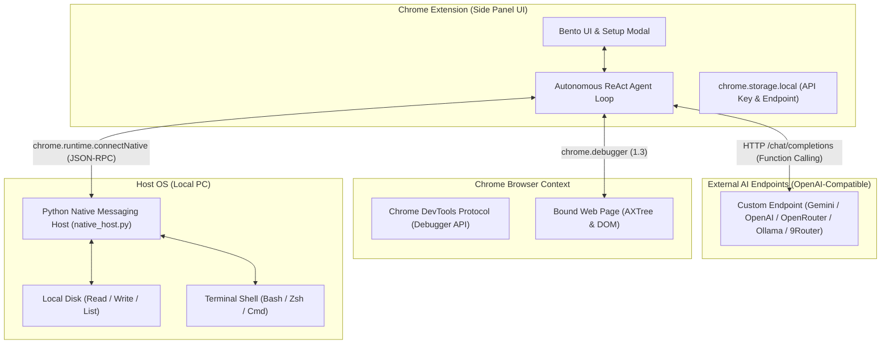

# 📑 DOKUMENTASI TEKNIS - BROWSER AGENT (STANDALONE)

Dokumen ini adalah referensi arsitektur teknis, protokol komunikasi, dan sistem tool-calling otonom untuk **Browser Agent**.

---

## 🏗️ 1. Arsitektur Sistem

---

## 🛠️ 2. Spesifikasi Tool Calling (16 Tools)

### A. Browser Automation & Multi-Tab Tools (12 Tools via CDP & Tabs API)
1. `browser_navigate(url)`: Mengarahkan tab aktif ke URL yang ditentukan.
2. `browser_snapshot()`: Mengambil snapshot DOM interaktif dan Accessibility Tree dengan `backendNodeId`.
3. `browser_click(backendNodeId)`: Menghitung koordinat box model dan menyimulasikan klik mouse via CDP.
4. `browser_type(backendNodeId, text, pressEnter)`: Memfokuskan input dan menyisipkan teks.
5. `browser_press_key(key)`: Mengirimkan sinyal keyboard event (`Enter`, `Escape`, `Tab`, dll).
6. `browser_hover(backendNodeId)`: Mengarahkan pointer kursor ke atas elemen.
7. `browser_scroll(scrollX, scrollY)`: Menggulir halaman web dengan delta piksel.
8. `browser_screenshot()`: Mengambil tangkapan layar tab aktif dalam format base64 PNG.
9. `browser_get_console_logs()`: Mengambil log konsol dan runtime error tab.
10. `browser_list_tabs()`: Menampilkan seluruh tab browser yang sedang terbuka (tabId, title, url, active).
11. `browser_switch_tab(tabId)`: Berpindah fokus dan mengikat kontrol agent ke tab tertentu berdasarkan tabId, judul/URL fuzzy, atau auto-open service URL.
12. `browser_create_tab(url)`: Membuka tab baru di browser dan langsung mengalihkan fokus agent ke tab tersebut.

### B. Local PC Tools (4 Tools via Native Host JSON-RPC)
13. `local_read_file(path)`: Membaca teks file dari disk lokal PC pengguna.
14. `local_write_file(path, content)`: Menulis atau membuat file baru di PC lokal (auto-create parent directories).
15. `local_list_dir(path)`: Menampilkan daftar file dan folder beserta ukuran dan tipe file.
16. `local_run_command(command, cwd)`: Menjalankan perintah terminal di PC lokal dengan capture stdout, stderr, dan exit code.

---

## ⚙️ 3. Konfigurasi AI & Presets

- **Penyimpanan:** Disimpan secara aman di `chrome.storage.local`.
- **Dukungan Format:** Mengikuti standar OpenAI Chat Completions API (`/chat/completions`) dengan `tools` parameter.
- **Provider Presets:**
  - **Google Gemini:** `https://generativelanguage.googleapis.com/v1beta/openai` (Model: `gemini-2.5-flash`, `gemini-2.5-pro`).
  - **OpenAI:** `https://api.openai.com/v1` (Model: `gpt-4o`, `gpt-4o-mini`).
  - **OpenRouter:** `https://openrouter.ai/api/v1` (Multi-provider model selection).
  - **Ollama Local:** `http://localhost:11434/v1` (Local open-source models).
  - **9Router Local:** `http://localhost:20128/v1` (Local router / proxy).
  - **Custom Endpoint:** URL kustom pengguna + input nama model bebas.

---

## 🔒 4. Keamanan & Target Tab Pinning

1. **Target Tab Binding:** Saat sidepanel dimuat, target debugger langsung dikunci ke tab awal. Berpindah ke tab lain saat multitasking tidak akan memindahkan target automasi.
2. **Re-binding Interaktif:** Pengguna dapat berpindah target tab kapan saja dengan mengklik chip status `Tab: [Nama]`.
3. **Local RPC Isolation:** Hanya ekstensi dengan ID yang terdaftar dalam manifest Native Messaging yang diizinkan memanggil RPC file dan shell execution.
