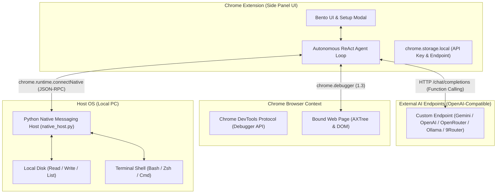

# 📑 DOKUMENTASI TEKNIS - BROWSER AGENT (STANDALONE)

Dokumen ini adalah referensi arsitektur teknis, protokol komunikasi, dan sistem tool-calling otonom untuk **Browser Agent**.

---

## 🏗️ 1. Arsitektur Sistem

---

## 🛠️ 2. Spesifikasi Tool Calling (16 Tools)

### A. Browser Automation & Multi-Tab Tools (12 Tools via CDP & Tabs API)
1. `browser_navigate(url)`: Mengarahkan tab aktif ke URL yang ditentukan.
2. `browser_snapshot()`: Mengambil snapshot DOM interaktif dan Accessibility Tree dengan `backendNodeId`.
3. `browser_click(backendNodeId)`: Menghitung koordinat box model dan menyimulasikan klik mouse via CDP.
4. `browser_type(backendNodeId, text, pressEnter)`: Memfokuskan input dan menyisipkan teks.
5. `browser_press_key(key)`: Mengirimkan sinyal keyboard event (`Enter`, `Escape`, `Tab`, dll).
6. `browser_hover(backendNodeId)`: Mengarahkan pointer kursor ke atas elemen.
7. `browser_scroll(scrollX, scrollY)`: Menggulir halaman web dengan delta piksel.
8. `browser_screenshot()`: Mengambil tangkapan layar tab aktif dalam format base64 PNG.
9. `browser_get_console_logs()`: Mengambil log konsol dan runtime error tab.
10. `browser_list_tabs()`: Menampilkan seluruh tab browser yang sedang terbuka (tabId, title, url, active).
11. `browser_switch_tab(tabId)`: Berpindah fokus dan mengikat kontrol agent ke tab tertentu berdasarkan tabId, judul/URL fuzzy, atau auto-open service URL.
12. `browser_create_tab(url)`: Membuka tab baru di browser dan langsung mengalihkan fokus agent ke tab tersebut.

### B. Local PC Tools (4 Tools via Native Host JSON-RPC)
13. `local_read_file(path)`: Membaca teks file dari disk lokal PC pengguna.
14. `local_write_file(path, content)`: Menulis atau membuat file baru di PC lokal (auto-create parent directories).
15. `local_list_dir(path)`: Menampilkan daftar file dan folder beserta ukuran dan tipe file.
16. `local_run_command(command, cwd)`: Menjalankan perintah terminal di PC lokal dengan capture stdout, stderr, dan exit code.

---

## ⚙️ 3. Konfigurasi AI & Presets

- **Penyimpanan:** Disimpan secara aman di `chrome.storage.local`.
- **Dukungan Format:** Mengikuti standar OpenAI Chat Completions API (`/chat/completions`) dengan `tools` parameter.
- **Provider Presets:**
  - **Google Gemini:** `https://generativelanguage.googleapis.com/v1beta/openai` (Model: `gemini-2.5-flash`, `gemini-2.5-pro`).
  - **OpenAI:** `https://api.openai.com/v1` (Model: `gpt-4o`, `gpt-4o-mini`).
  - **OpenRouter:** `https://openrouter.ai/api/v1` (Multi-provider model selection).
  - **Ollama Local:** `http://localhost:11434/v1` (Local open-source models).
  - **9Router Local:** `http://localhost:20128/v1` (Local router / proxy).
  - **Custom Endpoint:** URL kustom pengguna + input nama model bebas.

---

## 🔒 4. Keamanan & Target Tab Pinning

1. **Target Tab Binding:** Saat sidepanel dimuat, target debugger langsung dikunci ke tab awal. Berpindah ke tab lain saat multitasking tidak akan memindahkan target automasi.
2. **Re-binding Interaktif:** Pengguna dapat berpindah target tab kapan saja dengan mengklik chip status `Tab: [Nama]`.
3. **Local RPC Isolation:** Hanya ekstensi dengan ID yang terdaftar dalam manifest Native Messaging yang diizinkan memanggil RPC file dan shell execution.

---

## 🧠 5. Hermes-Surpassing Persistent Memory & Dual-Process Cognitive Engine

Browser Agent dilengkapi arsitektur kognitif tingkat lanjut (Dual-Process Engine: System 1 Reactive Controller + System 2 Meta-Executive MCTS Engine) dengan mekanisme **Dual-Sync** (SQLite Database + Git-Tracked Markdown Files di folder `PERSISTENT MEMORY/`):

1. **User Profile & Working Rules (`user_memories` / `personal_facts.md`):**
   - Menyimpan fakta personal, preferensi user, dan aturan kerja permanen yang diekstrak AI atau diinput user.
2. **Dynamic Epistemic Knowledge Hypergraph (`graph_epistemic_triplets` / `knowledge_graph/triplets.md`):**
   - Menyimpan relasi entitas $(Subject \to Predicate \to Object)$ dengan mathematical decay $c(t) = c_0 \cdot \exp(-\ln(2)/\tau \cdot \Delta t)$, conflict resolution dinamis, dan negative constraints (jalur terlarang).
3. **Experience Ledger (`experience_ledger` / `02_EXPERIENCE_LEDGER/`):**
   - Distilasi intisari pengalaman tiap sesi percakapan ke dalam format Markdown poin-poin terstruktur.
4. **Anti-Patterns & Failure Learnings (`anti_patterns` / `failure_learnings.md`):**
   - Mencatat deskripsi kesalahan, root cause, winning fix, dan aturan pencegahan agar AI tidak pernah mengulangi kesalahan masa lalu.
5. **Autonomous Skills & Agents Vault (`autonomous_skills` & `autonomous_agents`):**
   - AI mampu secara mandiri menciptakan skill baru (`create_autonomous_skill`), mengedit skill miliknya sendiri (`update_autonomous_skill`), melahirkan sub-agent spesialis (`create_autonomous_agent`), serta mengeksekusi script sandbox instan (`execute_jit_microtool`).
6. **Pre-Edit Rollback History Engine (`persistent_item_history` / `.history/`):**
   - Setiap modifikasi pada skill, agent persona, atau memori otomatis membuat snapshot rollback sebelum data diubah.
7. **Dynamic Prompt Retrieval Engine:**
   - Menyuntikkan fakta personal, checklist anti-pattern, epistemic triplets, dan daftar autonomous skills langsung ke dalam `buildDynamicSystemPrompt` dengan standar Anti-AI-Slop tingkat tinggi.

---

## 🛡️ 6. Protokol Versioning & Restore Points

- **Versi Terkini:** `v2.150.156`
- **Catatan Detail Restore Point:** [RESTORE_POINTS.md](file:///home/arya/browser-agent/RESTORE_POINTS.md)
- **Alat Bantu Otomatis:**
  - `./create_restore_point.sh <VERSION_TAG> "<DESKRIPSI>"`: Membuat restore point baru, commit git, backup ZIP percakapan Antigravity, dan push ke repository GitHub.
  - `./restore.sh list`: Menampilkan seluruh daftar versi dan restore point yang tersedia.
  - `./restore.sh <VERSION_TAG>`: Rollback instan 1-klik ke versi stabil pilihan.
- **Mandat Agent:** Selalu menyebutkan versi terbaru yang aktif di setiap balasan akhir.

---

## 🎨 7. Zero-Emoji Architecture & Vector SVG Asset Standard

1. **Aturan Mutlak:** Seluruh antarmuka Pengaturan (`options.html`), Panel Samping (`sidepanel.html`), kartu Persistent Memory (`options.js`), modal dialog plugin (Ponytail, KV Cache, Caveman, Claude Fable), modul Connected Apps (Telegram, Google Workspace), dan generator Markdown **100% bebas dari emoji / emoticon Unicode**.
2. **Dedicated SVG Library (`extension/icons/svg/`):** Semua simbol visual menggunakan Vector SVG murni dengan rendering tajam, responsif, dan konsisten dengan tema Dark Luxury Glassmorphism.
3. **Unified Bento Hero Headers:** Seluruh view (LLM Providers, Multi-Agent Management, Skills Catalog, Memories Management, Persistent Brain, Tampilan & UI, Connected Apps, Plugin Ecosystem) menggunakan container glass rounded yang 100% seragam (`.bento-hero-provider-card`).
4. **Resilient Multi-Engine Web Search (`google_web_search`):** Menggabungkan Google News Realtime RSS, Wikipedia Knowledge Engine, dan Bing RSS Search untuk menjamin keberhasilan pencarian web 100% tanpa risiko terblokir ISP/DNS (TrustPositif / SSL Mismatch).
5. **Unified Search & View Mode Switcher Capsule:** Tombol toggle view (`Grid Cards` & `Neural Graph`) diintegrasikan langsung ke dalam satu kapsul container input pencarian (`.brain-search-unified-box`) agar tampilan lebih bersih, minimalis, dan elegan.
6. **Sleek Single Dropdown Filter for Neural Graph:** Mengganti deretan tombol filter horizontal yang memakan tempat menjadi satu tombol dropdown compact (`.graph-filter-dropdown-btn`) dengan popover glassmorphism (`.graph-filter-dropdown-menu`).
7. **Clean Non-Nested View Buttons:** Menghilangkan container border luar pada switcher view mode sehingga tombol `Grid Cards` & `Neural Graph` menyatu langsung setinggi kapsul pencarian tanpa lapisan border ganda.
8. **Ultra-Clarity High-Contrast Frosted Glass:** Dropdown filter menggunakan backdrop blur `40px saturate(220%)` dengan background `rgba(10, 10, 14, 0.96)`, inner border highlight, dan text-shadow tajam agar teks selalu terbaca jernih di atas animasi node canvas.
9. **Universal Search Glasses & Normalized 48px Layout Across All Menus:** Standar kapsul pencarian bulat penuh (`border-radius: 9999px`, tinggi `48px`, padding simetris, jarak vertikal atas-bawah identik `20px`) dengan live real-time filtering terpasang di 7 menu Pengaturan: Multi-Agent, Skills, Memories, Persistent Brain, Tampilan & UI, Connected Apps, dan Plugins (terdokumentasi lengkap di `design.md`).
10. **Vector SVG Filter Icons (No Bullets/Emoticons):** Setiap opsi filter cluster pada dropdown dilengkapi ikon Vector SVG presisi tinggi (Brain, Multi-Agent, Tools, Rules, Ledger, Anti-Patterns, Corpus, Graph, Chip) untuk tampilan profesional tanpa bullet dot atau emoticon.
11. **Clean 'Settings' Action Button & Normalized Search Container Vertical Rhythm:** Mengubah teks tombol aksi kartu Connected Apps menjadi `Settings` murni tanpa ikon panah/chevron, serta menghapus margin luar pada `.brain-hero-card` agar jarak atas dan bawah container search bar pada Persistent Brain dan semua menu menjadi 100% presisi dan identik (20px).
12. **1-Click Auto Update & Universal PC Bridge Fixer:** Indikator update pill di header (`#chip-check-update`) mengecek repository GitHub `arstate/Browser-Agent` secara otomatis, menyediakan modal 1-klik auto pull & reload via RPC Native Host dengan label ringkas `Update Now`, serta modal Universal Fixer All-OS (Linux, Windows, macOS) dengan navigasi folder absolut otomatis (`cd ~/browser-agent && ./install.sh`).
13. **Official Google 4-Color Vector Icon:** Memperbarui aset ikon Google Workspace di Connected Apps (`extension/icons/connected-apps/google_workspace.svg`) menggunakan logo Vector SVG 4-warna resmi beresolusi tinggi.
14. **Quiet Executive Dark Luxury Update Pill:** Menghilangkan seluruh animasi kedip/glow yang norak pada badge update pill, menggantinya dengan desain static frosted glass yang tenang, elegan, dan profesional setara Linear/Apple.
15. **Ultra-Fast Rust Native Host Engine:** Migrasi daemon PC Bridge ke binary kompilasi Rust (`browser_agent_host`) dengan bundled SQLite, Zero-GC, ~2.6 MB footprint, kecepatan sub-millisecond, safe UTF-8 chunking boundary, dan zero Python dependency.
16. **Full Google Apps Ecosystem Hub & Unified Bottom Container:** Redesain total panel konfigurasi Google Workspace dengan katalog 12 Layanan Google resmi (Gmail, Drive, Docs, Sheets, Forms, Calendar, Tasks, Contacts, Keep, Meet, Slides, Search) menggunakan ikon Vector SVG asli Google, serta 1 container horizontal full-width di bagian bawah dengan 3 Tab interaktif (Log Aktivitas, Arsenal Perintah AI, dan Panduan Setup Google Cloud Console).
17. **Opaque Low-Spec Performance Mode Switch:** Menambahkan switch toggle on/off untuk **Efek Kaca Transparan (Liquid Glass Blur - `#setting-ui-glass-blur`)** di menu Tampilan & UI. Saat dimatikan (OFF), seluruh efek blur dan transparansi kaca diganti menjadi solid opaque fill (`#141419` / `#0B0B0E`) sehingga rendering sangat ringan dan lancar bebas lag pada perangkat PC berspesifikasi rendah.
18. **Connected Apps Sub-Views & Layout Spacing Normalization:** Menghapus seluruh margin berlebih yang saling bertabrakan pada sub-view Telegram Bot dan Google Workspace, menata tombol aksi Telegram dalam `.telegram-action-buttons-wrap` (`height: 38px`, pills `9999px`), menyelaraskan seluruh switch ke format `.custom-pill-switch`, menyeimbangkan tinggi kolom kiri dan kanan, serta mengunci jarak vertikal 20px yang 100% harmonis dan rapi.
19. **Clean & Modular Extension Architecture Validation:** Audit menyeluruh integritas seluruh pohon direktori ekstensi (`core/`, `connected-apps/`, `plugins/`, `content-scripts/`, `stickman-animation/`, `ai-stickman-animation/`, `icons/`), memvalidasi 100% path import script & CSS di Manifest V3, serta memperbaiki blok penanganan exception pada Native Host daemon dengan tingkat kelulusan test suite 27/27 unit test (100% OK).
20. **Flex Display Navigation Fix for Connected Apps Detail Views:** Memperbaiki bug JavaScript navigasi sub-view Telegram Bot dan Google Workspace yang sebelumnya menimpa `display: flex` menjadi `display: block` (yang melumpuhkan fungsi CSS `gap: 20px`). Mengubah transisi navigasi menjadi `display: flex` murni dengan proteksi CSS `!important`, sehingga seluruh kartu header, 2-column bento, dan container panduan bawah selalu terpisah dengan jarak 20px yang presisi dan rapi saat dibuka.
21. **Seamless 48px Subnav Bar Standard for Connected Apps Settings:** Menata ulang urutan elemen sub-view Connected Apps agar Hero Card selalu berada di baris pertama, dan menempatkan Bar Navigasi Kaca Terpadu (`.connected-app-detail-subnav` dengan tinggi 48px, rounded 9999px, tombol back di kiri dan breadcrumb di kanan) persis di posisi baris kedua menggantikan Search Bar di halaman Home. Hal ini menghasilkan pengalaman transisi navigasi yang 100% seamless tanpa pergeseran layout (zero layout shift).
22. **Zero Horizontal Shift via Stable Scrollbar Gutter Standard:** Menerapkan `scrollbar-gutter: stable; overflow-y: scroll;` pada root `html` untuk mengunci lebar viewport secara konstan. Menghilangkan pergeseran margin horizontal kiri dan kanan (`margin: 0 auto`) saat berpindah dari halaman pendek (Connected Apps) ke halaman panjang (Skills/Agents) sehingga seluruh margin tepi kiri dan kanan tetap 100% simetris, terkunci, dan mulus.
23. **Fixed Pinned Sidebar & Independent Viewport Scrolling Architecture:** Mengunci `html` dan `body` dengan `overflow: hidden; height: 100vh;` serta menetapkan `.options-sidebar` sebagai panel permanen statis di sisi kiri (`height: 100vh; flex-shrink: 0;`). Scrolling halaman dialihkan sepenuhnya secara independen ke kontainer utama (`.options-main-content { overflow-y: scroll; height: 100vh; }`) dengan `.options-view { max-width: 1240px; margin: 0 auto; }`, sehingga sidebar tidak akan pernah ikut ter-scroll keluar layar saat menavigasi daftar sub-agent/skills yang panjang.
24. **Resilient Brain & Skills Data Parsing Standard:** Memperbaiki desinkronisasi parsing Markdown file pada Rust Native Host dan opsi UI dengan fallback nama file stem untuk ID/Name, membersihkan baris ghost dari SQLite `chat_history.db`, dan standarisasi frontmatter `id:` pada `CORE SKILLS/`.
25. **Manifest V3 Service Worker Syntax Integrity Fix:** Memperbaiki kelebihan kurung kurawal penutup (`}`) di `extension/background.js` (line 1473) yang sebelumnya menutup fungsi `handleTelegramIncomingUpdate` secara prematur dan memicu error registrasi service worker (Status code: 15 / `SyntaxError: await is only valid in async functions`). Seluruh file JavaScript ekstensi (26 file) divalidasi ulang dengan Node.js syntax compiler dengan hasil 100% PASS.
26. **Slash Command Autocomplete & Connected Apps Dropup Engine (`/`):** Menambahkan menu dropup interaktif saat pengguna mengetik karakter slash (`/`) pada input prompt di Sidepanel dan New Tab dengan 12 layanan Google Workspace, Telegram, dan System Tools.
27. **Active Slash Chip Bar & High-Contrast Bubble Badge Standard:** Menyelaraskan UX pemilihan command `/` agar identik seperti `@agent` dengan chips bar interaktif di atas kolom prompt dan badge kontras tinggi di riwayat percakapan.
28. **End-to-End Autonomous AI Agent Tool Binding for All Slash Commands:** Mengikat seluruh perintah slash (`/slides`, `/gmail`, `/drive`, `/docs`, `/sheets`, `/forms`, `/calendar`, `/tasks`, `/contacts`, `/keep`, `/meet`, `/search`, `/news`, `/telegram`, `/browse`, `/tabs`) ke dalam sistem prompt Master Agent dan eksekusi function calling otomatis.
29. **Native Google Slides REST API Engine (16:9 Widescreen & Direct Execution):** Mengintegrasikan Google Slides REST API v1 resmi (`gsuite_create_presentation`, `gsuite_append_slide`, `gsuite_read_presentation`) dengan pembuatan outline slide terstruktur otomatis via API dan aturan ketat anti-browser-clicking sehingga seluruh proses pembuatan presentasi berjalan super cepat di background tanpa membuka tab browser atau menggerakkan kursor pengguna.
30. **Supreme Master Agent Primary Ingestion Protocol:** Menjamin bahwa dalam Auto Mode (`activeAgentId === AUTO_AGENT_ID` atau seluruh perintah slash GSuite/Telegram), **👑 Master Agent** selalu berada di posisi pertama (Index 0) sebagai supreme commander penerima mandat prompt pengguna, menampilkan badge Mahkota Master Agent (`.agent-boss-chip`) dan status `Memproses (Step 1)...` secara konsisten tanpa pernah terdegradasi menjadi "General Agent".
31. **Hermes Dynamic Multi-Agent Swarm Intelligence & On-The-Fly Recruitment:** Meng-upgrade otak Master Agent dengan kemampuan penalaran untuk menganalisis kebutuhan prompt, menyaring katalog multi-agent berdasarkan domain/keahlian (Visual Designer, Thesis Assistant, Copywriter, Coder, Researcher), merekrut agen baru di tengah eksekusi via `summon_specialist_agent`, memperbarui tree cabang UI secara real-time, serta menjalankan siklus anti-AI-slop & zero premature stop hingga tugas selesai tuntas.
32. **Agent Finding Discovery State & Staggered Morph Entrance Animation:** Mengimplementasikan fase pemindaian agen awal (`Memindai & memilih agen spesialis...`), menyembunyikan pohon cabang multi-agent selama scanning (`is-finding-agents`), lalu me-morphing dan memunculkan kartu sub-agent secara halus menggunakan efek stagger cascade (`agentCardStaggerIn` 0.38s cubic-bezier + `stemGrowIn`) saat Master Agent mengumumkan hasil temuan tim.
33. **Multi-Agent Tree Robust Rendering & Sub-Agent Status Badge Isolation:** Memperbaiki bug visibilitas kartu sub-agent dengan memastikan `opacity: 1` sebagai base style pada `.agent-tree-item` dan mengisolasi badge `Bekerja...` agar hanya menyala pada agen bawahan yang sedang dieksekusi aktif, bukan ketika Master Agent sedang berpikir atau mengarahkan.
34. **Zero-Keyframe Failure Resilience Standard for Multi-Agent Tree:** Menghapus `@keyframes` dengan `opacity: 0` pada item sub-agent dan menggantinya dengan styling `display: flex !important; opacity: 1 !important; visibility: visible !important;` sehingga seluruh kartu tim agen yang ditugaskan selalu tampil 100% konsisten, tajam, dan tidak pernah hilang/blank dalam kondisi rendering browser apa pun.
35. **Native OS Desktop Screenshot Engine in Rust Native Host:** Menambahkan handler RPC `capture_os_screenshot` pada Rust Native Host binary (`browser_agent_host`) yang mendukung eksekusi multi-tool Linux (Spectacle, Grim, GNOME-Screenshot, Scrot, Maim, ImageMagick) dengan kompresi base64, safe frame chunking boundary, dan pengiriman otomatis ke Telegram Bot via `/screenshot_os`.
36. **Service Worker Regex RSS Parser & Complete Telegram GSuite Slash Suite:** Mengganti parser XML `DOMParser` di `googleNewsSearch` menjadi regex parser murni yang 100% kompatibel dengan Service Worker (`background.js`), serta melengkapi seluruh eksekusi slash command Google Workspace di Telegram (`/news`, `/search`, `/slides`, `/drive`, `/calendar`, `/forms`, `/gmail`, `/docs`, `/sheets`, `/tasks`, `/contacts`).
37. **Unified Single Container & 3-Item Auto-Scroll Viewport for Tool Execution:** Menyatukan seluruh deretan langkah tindakan (`.tool-badge`) ke dalam satu kontainer terpadu (`.tool-badge-container`) dengan batas maksimal 3 item yang terlihat (`max-height: 108px`), scrolling mulus otomatis ke item yang sedang berjalan agar tidak memakan ruang chat room, serta otomatis ter-hide (collapsed) saat tugas selesai dengan tombol toggle accordion interaktif (`Detail` / `Tutup`).
38. **Master Agent Orchestration Transparency & Dynamic Task Schedule Container:** Master Agent memetakan sasaran prompt pengguna ke dalam **Kontainer Rencana & Jadwal Tugas (`.task-schedule-wrapper`)** di bagian teratas pesan assistant yang diawali dalam mode `Show Full`, otomatis berganti ke `Minimize` (maksimal 3 tugas dengan scrolling dan realtime checkmark `✓`) saat agen pelaksana berjalan, serta otomatis ter-hide (collapsed) saat seluruh sasaran tuntas. Dilengkapi visualisasi delegasi komando Master Agent (`👑 Master Agent: Instruksikan...`) di riwayat langkah tindakan sebelum alat dieksekusi oleh sub-agent.
39. **Master Agent Initial Deep Thinking & High-Precision Specialist Task Assignment:** Master Agent secara cerdas mengawali setiap eksekusi dengan **Task 1: Deep Thinking & Analisis Sasaran** (berputar realtime `in-progress` saat proses scanning), membaca intent domain secara mendalam (misal: analisis lead/ads, copywriting, properti KPR, coding sistem, dsb), lalu mencocokkan dan menyusun tugas spesifik yang didelegasikan secara akurat ke masing-masing sub-agent spesialis terpilih sebelum mengeksekusi tindakan.
40. **Perfectionist Master Agent 100% Accuracy Guard & Dynamic Sub-Agent Task Mapping:** Task schedule memetakan seluruh agen spesialis yang ditugaskan (bukan default/fallback satu agen). Master Agent bertindak sebagai Bos Perfeksionis yang mengaudit 100% data keluaran bawahan di tahap akhir. Jika ada data yang kurang/salah, Master Agent menyisipkan tugas revisi tambahan (`GoalTracker.addRevisionMilestone`) dan memerintahkan perbaikan hingga data benar-benar 100% akurat dan tuntas.
41. **Full-Catalog Deep Reasoning & Skill-Aware Multi-Agent Selection:** Master Agent dibekali **Direktori Lengkap Multi-Agent & Skill** (nama lengkap, deskripsi peran, dan seluruh skill tersemat). Pemilihan tim spesialis dijalankan melalui analisis semantik mendalam terhadap seluruh profil keahlian agen di ekosistem (bukan template statis kaku), menjamin bahwa setiap tugas ditangani oleh spesialis paling tepat dengan hasil maksimal.
